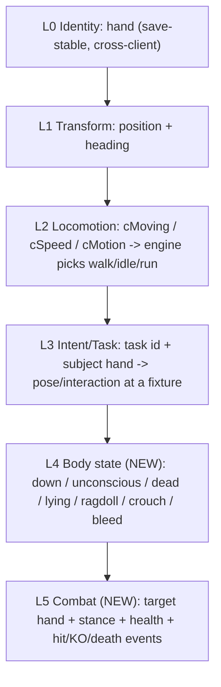

# Kenshi Co-op: The Intent-Replication Framework

> Status: Design framework (forward-looking). Generalizes the two big wins of
> Phase 2 - the v4 locomotion mirror and the sit/stand task-pose sync - into the
> single principle the rest of the project should be built on. Companion to
> `MASTER_PLAN.md` (charter) and `POSTMORTEM.md` (what we learned getting here).
> Grounded in the current code: `src/netproto/Wire.h` (the wire shape),
> `src/plugin/sync/Replicator.cpp` (apply regimes), `src/plugin/game/Engine.h`
> (the engine levers).

## The core principle: replicate causes, not effects

Every replicated behavior the join renders is produced by **the join's own engine**
from a small set of replicated *inputs*. We never stream the animation itself
(clip id + phase). We stream the **causes** - identity, transform, locomotion
state, AI intent, and body state - and let the local engine compute the matching
animation, then we quiet the local AI so it does not override the result, and we
keep an authority guard so divergence is bounded.

This was not the original plan - we arrived at it empirically, after two
transform-only / clip-level dead-ends (see `POSTMORTEM.md`):

- Streaming a **transform** for a resting NPC produced the wrong pose (it stood
  where the host sat).
- Streaming a **clip** directly was not viable - idle/sit/stand are not slave
  animations (`runSlaveAnim` logged zero calls) and `AnimationClass` is opaque.
- Streaming the **cause** - the locomotion scalars (v4), and then the AI **task +
  subject** - produced the correct pose *and* position, cheaply.

Why this matters for the whole project: the per-entity wire cost is roughly
**constant as animation variety grows**. A seated pose is ~2 bytes of task id plus
a 20-byte subject hand, regardless of how complex the seated animation is, and it
is **idempotent** (re-applied every tick, so packet loss self-heals). Laying, KO,
crafting, and combat are all the same shape with a different lever - so the
framework scales without a bandwidth blow-up or a bespoke netcode path per
animation.

## The layered model

`EntityState` in `src/netproto/Wire.h` and the regime selection in
`Replicator::applyTargets` -> `applyRest` already implement layers 0-3. The
framework names them and adds two:

- **L0 Identity (`hand`).** The five-field Kenshi `hand` is save-stable and
  identical across machines that load the same save, so a streamed entity resolves
  to the real local `Character`/`RootObject`. This is the cornerstone - it is what
  lets us "drive the real local object" instead of puppeting a ghost. DONE.
- **L1 Transform.** Position + heading. Authoritative while a body is in motion or
  at a held rest. DONE (`applyRaw`, `park`).
- **L2 Locomotion.** `cMoving` / `cSpeed` / `cMotion`: the engine's `AnimationClass`
  selects walk/idle/run from these. We mirror them as the last write of the frame
  for at-rest bodies, and for moving bodies we let the engine set them itself by
  driving a real walk. DONE (v4 mirror + walk-drive).
- **L3 Intent/Task.** `task` (engine `TaskType`) + the subject `hand` the task
  targets. The join reproduces the pose/interaction at the *same* fixture. DONE for
  sit/operate; crafting/gathering is the next instance (same lever).
- **L4 Body state (NEW).** Poses that are not a task at a fixture - knocked out,
  unconscious, dead, lying down, ragdolling, crouched, bleeding. These cannot be
  expressed as a task+subject and need a compact state field plus an apply path
  that sets the body state directly with NO pathing.
- **L5 Combat (NEW).** The interactive, fast-changing state of a fight: combat
  target hand, stance, health, plus one-shot events (hit reaction, the instant of
  KO/death). Host-authoritative resolution.

## The three levers every class needs

Each layer/class is applied on the join with the same triplet (this is the
doctrine `POSTMORTEM.md` records, named here so new classes follow it):

1. **Apply lever** - drive or inject the input. Existing primitives in
   `Engine.h`: `applyRaw` (teleport), `walkTo`/`park` (locomotion),
   `applyTaskOrder` (player-order pose at a fixture), `applyMotion` (mirror
   locomotion scalars).
2. **Quieting lever** - stop the local AI from overriding the input. Existing
   primitives: `clearGoals`, AI-suspend (`addAiSuspend`), `detachFromTownAI` +
   order (sitters), `endAction` + relapse re-quiet (standers). The sit/stand work
   proved these are **not interchangeable** - see the asymmetry rule below.
3. **Authority/drift guard** - bound divergence. Existing: `TASK_DRIFT_MAX`
   abandon-to-park, `SNAP_DIST` hard teleport, `enforceHostAuthority`
   suppress/restore for world NPCs the host is/ is not streaming.

### The asymmetry rule (the hardest-won lesson)

The **same lever applied to the wrong class backfires.** Concretely, from the
sit/stand iterations:

- Sitters need `detachFromTownAI` + a persistent location-bound ORDER. Detach is
  safe *only because* the order immediately re-anchors them.
- Standers must **not** be detached: `separateIntoMyOwnSquad` changes the body's
  container, which changes its cross-client `hand` key, so the host can no longer
  match it and `enforceHostAuthority` suppresses it (it goes ABSENT). Standers get
  `endAction` only.

So the framework is explicitly a taxonomy of **(behavior class -> lever set)**, not
one universal code path. Adding a new class means choosing its lever set, not
reusing the last one blindly.

## Behavior taxonomy

- **Locomotion (moving).** Lever: lead-point walk-drive (`walkTo`) + catch-up
  speed; engine animates the gait itself. Guard: `SNAP_DIST` teleport. STATUS:
  DONE.
- **Fixture-bound task pose** (sit, operate, **craft, gather**). Lever:
  `detachFromTownAI` + `applyTaskOrder(subject)` so the body walks-and-poses at the
  exact fixture (a player order, not the autonomous goal that re-searches for any
  nearby fixture). Guard: `TASK_DRIFT_MAX` abandon. STATUS: DONE for sit/operate;
  crafting/gathering is the spearhead.
- **Node-bound idle pose** (stand-at-node). Lever: `endAction` + `park` + re-quiet
  on relapse (re-`endAction` only when the body reports a walk motion while held).
  No detach. STATUS: DONE.
- **State-driven pose, no subject** (laying, unconscious, KO, dead, ragdoll).
  Lever: set the body state directly from an L4 field; no task, no pathing. Guard:
  hold transform; do not walk-drive a downed body. STATUS: NEW (L4).
- **Interactive fast state** (combat). Lever: host-authoritative target/stance/
  health (L5 sub-batch) + reliable one-shot events for hit/KO/death. Guard: the
  host owns the outcome; the join renders reactions and never resolves a hit
  locally. STATUS: NEW (L5).

## Network ramifications

The headline is positive: streaming causes keeps the per-entity wire cost roughly
constant and the state idempotent (loss-tolerant). The framework changes the wire
in three bounded ways, plus two scaling levers we get for free.

### Wire changes

- **Add a body-state field to `EntityState` (L4).** A `u16` flag set
  (down / unconscious / dead / lying / ragdoll / crouched / bleeding) covers all
  no-subject poses in a couple of bytes. This is a packed-struct change, so it is
  backward-incompatible: **bump `PROTOCOL_VERSION`** in `src/netproto/Wire.h` (the
  handshake rejects mismatches, which is the desired behavior - no half-upgraded
  sessions).
- **Add a reliable event sub-channel (`PKT_EVENT`).** Some behaviors are *events*,
  not *states*: the instant of death/KO, a hit reaction, a gesture, a recruit. The
  current `PKT_ENTITY_BATCH` is 20 Hz **unreliable** - correct for continuous state
  (a dropped frame self-heals next tick) but wrong for a one-shot (a dropped death
  event leaves a body alive on the join). Add a small **reliable, sequenced**
  `PKT_EVENT` carried on ENet's reliable channel alongside the unreliable state
  batch. State stays idempotent on the unreliable channel; transitions that must
  not be lost go on the reliable channel.
- **Carry combat state as an optional sub-batch (L5), not as bloat on every
  `EntityState`.** Target / stance / health only matter for entities currently in
  combat. Widening every entity by ~10 bytes for a field that is null 95% of the
  time wastes the datagram budget; instead send a separate optional batch keyed by
  `hand`, present only for combatants.

### Scaling levers we already have

- **Divergence-gated authority.** `applyTargets` already logs a `[gate]` metric:
  host `rawTask` vs the join's own local task for each NPC. High agreement means
  the local AI is independently doing what the host is doing, so we could *trust
  local simulation* there and actively drive only on divergence. This reduces the
  set we must drive, cuts redundant correction, and degrades gracefully under
  latency/load. It is currently logged-not-acted-on; the framework promotes it to a
  first-class authority mode.
- **Rate tiers / interest LOD.** Keep locomotion + pose at 20 Hz; give nearby
  combatants a faster or event-driven tier; drop the rate for distant entities.
  Interest management (`captureNpcs` / `listNpcs`) already bounds the active set, so
  this is a per-tier cadence on top of an existing cap.

### What does NOT change

- **Identity stays `hand`-based** for every layer, including L4/L5. A combat target
  is referenced by the target's `hand`, not a pointer or a network id.
- **The transport stays ENet 20 Hz** for state; we only add a reliable channel for
  events, which ENet already supports.
- **Shared-save remains mandatory** - resolve-by-`hand` only works when both
  clients load the identical save.

## Scaling validation: the per-class conformance oracle

The sit/stand work produced a reusable validation pattern; the framework makes it
the standard for every new class. The pelvis / `isIdle` / `isCrouched` / `task`
oracle (`engine::readPoseState` in `Engine.h`, `Compare-NpcPoseState` in
`scripts/run_test.ps1`) is one instance of a general recipe.

Every new behavior class ships with a **conformance triplet**:

1. **Host ground-truth read** - the authoritative engine state for that class on
   the host (e.g. `task` + subject for poses; an `isDown`/health read for L4; a
   combat-target read for L5).
2. **Join rendered-body read** - read the *result on the rendered body*, not the
   field we wrote, so the check cannot self-confirm. (The pose oracle reads the
   `Bip01 Pelvis` world height off the animated skeleton precisely so a written
   `task` flag cannot fake a PASS.)
3. **Tolerance comparator + deterministic scenario** - a compiled `Scenario`
   (`src/plugin/test/Scenario.h`, driven via `ScenarioApi.h`) that sets up the
   state on both clients, plus a comparator in `run_test.ps1` that time-aligns the
   host and join reads and emits a RED/GREEN verdict (the existing `CROSSCHECK` /
   pose-state machinery).

This recipe is what lets us add a class and *know* it works without relying on
eyeballing a single screenshot. Each new class adds: a host read, a join
rendered read, a tolerance, and a baked scenario.

## Spearhead: crafting / gathering (the second proof case)

Crafting/gathering is the lowest-risk next class because it is a **fixture-bound
task pose** - the exact class the sit lever already solves. Implementing it proves
the framework's central claim (a new behavior is a new lever-set instance, not new
netcode), and it is high-value (bases, production, mining, farming are core Kenshi
loops).

### Why it should reuse the sit lever almost verbatim

A crafting/mining/farming NPC has an AI `task` whose subject is a work station
(research bench, smithy, ore node, farm plot). That is structurally identical to
`SIT_AROUND` on a stool: a task + a subject `hand`. So the apply path is the
existing `detachFromTownAI` + `applyTaskOrder(subject)` - detach so the town-AI
stops re-tasking, then a player order pinning the body to *this* station instead of
letting the autonomous goal re-search for any station.

### Design steps (no code in this doc)

- **Enumerate the task ids.** Identify the crafting / mining / farming `TaskType`s
  (the same enum that gave `SIT_AROUND`=87, `STAND_AT_NODE`=51) and confirm which
  are fixture-bound (reproducible via order) vs node-anchored (need the
  `endAction`/local-AI path instead). `engine::isNodeAnchoredPose` is the existing
  classifier to extend.
- **Confirm subject-hand resolution for non-`Building` subjects.** Sit subjects are
  furniture `Building`s. Work subjects may be **resource entities** (an ore
  deposit, a plant) rather than buildings - confirm these expose a save-stable
  `hand` that `engine::resolve` can turn into a local `RootObject`. THIS IS THE
  MAIN OPEN RISK; if a resource node has no stable cross-client hand, that subtype
  falls back to position-hold + the work animation via locomotion mirror.
- **Apply + guard.** Reuse `applyRest`'s order path and `TASK_DRIFT_MAX` abandon
  unchanged; expect the body to walk to and pose at the station.
- **Oracle.** Conformance triplet for this class: subject resolves on the join +
  body is at the station (position tolerance) + the work animation's pelvis/anim
  signature matches (a working body has a distinct stance from idle/seated).
- **Scenario.** Bake a save with a work station + a character assigned to craft
  there (the same "bake a deterministic scene then SAVE" method used for the seat
  scenes), then a `craft_sync` scenario that flips RED->GREEN like
  `squad_spawn_sync` did.

### Open risks to carry into implementation (not solved here)

- **Roaming gathering.** Some gathering walks between nodes (cut tree -> haul ->
  next tree): a locomotion + task interplay, not a static pose. The framework
  handles this as "L2 while moving, L3 at the node" - but the hand-off cadence
  needs validation.
- **Resource-node identity.** As above: resource subjects may not carry a stable
  cross-client `hand`.
- **Multi-stage jobs.** A craft that consumes inputs and produces outputs touches
  L4 world-object state (inventory), which is Phase 4 - the *pose* syncs first;
  the *production result* is a later layer.

## Re-prioritized roadmap

This framework reorders the `MASTER_PLAN.md` roadmap from "NPC fidelity then
combat" into a sequence of behavior classes ordered by ascending risk, each one a
new lever-set instance validated by its own conformance oracle:

- **Phase 3 - Intent-replication framework** (supersedes the old "NPC fidelity"):
  - **3a Crafting/gathering** [DONE] - reuse the fixture-task lever; lowest risk;
    proves framework reuse. Validated via `craft_order` (live idle->operating order).
  - **3b Body-state layer (L4)** [DONE] - laying / unconscious / KO / death /
    ragdoll. Added the `bodyState` field (continuous, unreliable, self-healing) AND
    the reliable event channel (`PKT_EVENT`: KO/death/revive transitions on ENet's
    reliable channel). Validated via `down_order` (live upright->down) and
    `death_order` (host kills subject -> join receives the reliable `EVT_DEATH`
    *even under 30% packet loss + latency*, because the event bypasses the
    unreliable-batch drop). No pathing.
  - **3c Combat (L5)** [DONE] - target / combat intent + reliable hit/KO/death events
    + host-authoritative outcome & attribution. Both stated dependencies (3b body
    state + the reliable event channel) were in place. Validated via `combat_probe`
    (host combat-state read), `combat_order` (live melee intent so a fight that
    starts *after* the join loads renders), and `combat_kill` (deterministic KO with
    sticky time-windowed attacker attribution). Hit/KO/death reuse `PKT_EVENT`;
    intent rides `TASK_COMBAT_MELEE`.
- **Phase 3.5 - Bidirectional per-tab ownership (presence keystone)** [DONE] -
  ownership partitioned by Kenshi squad tab (= the member's `hand` CONTAINER rank),
  with `publishOwned` + `applyTargets` running on BOTH clients and a drive-exclusion
  guard on each side's own published hands. This is the layer that gives the guest
  real agency over its own squad. Validated via `coop_presence` (bidirectional
  cross-check, 0 ms + WAN) and manual control on `squad1`. See `POSTMORTEM.md`
  addendum "Bidirectional per-tab ownership".
- **Phase 4 - World objects** - inventory, buildings, items in the active zone
  (the production *results* of 3a, plus general object state).
  - **4a Inventory / container-contents (content-snapshot/reconcile)** [DONE] -
    runtime-minted items (craft output, loot) have HOST-ONLY hands that don't resolve
    on the join, so item objects are NOT driven by `hand`. Instead the host streams a
    container's CONTENTS as a description (template `stringID` + `itemType` + quantity
    + quality) keyed by the CONTAINER's stable `hand`, and the join RECONSTRUCTS items
    locally (`createItem`+`tryAddItem` for shortfalls, `removeItemAutoDestroy` for
    excess) to match - idempotent + loss-tolerant. Rides the RELIABLE channel on a
    content-hash change (+ periodic safety resend). v1 anchors on the leader's own
    inventory (a save-stable container that accepts arbitrary items); host-authoritative
    (`applyInventories` never reconciles a container the client authors). Validated via
    `inv_order` (host live-add, host/join final-hash match, 0 ms + WAN 80/30/30% - the
    add survives loss because the snapshot is reliable) plus the existing-scenario
    regressions (`npc_sync`/`combat_kill`/`coop_presence`) staying green. **Now
    BIDIRECTIONAL:** each client authors the inventory of every squad member it owns
    (the `ownHands_` tab-rank partition - host tab 0, join tab 1) and reconciles the
    peer's; `publishInventories` is gated behind `invSync`. Validated via `inv_bidir`
    (host AND join each ADD-then-REMOVE their owned container; per-rank convergence both
    ways with distinct net deltas) at 0 ms + WAN 120/40/30%. Doctrine 23. **Now covers
    EQUIPPED gear (ALL slots):** worn gear lives in equipment SECTIONS, not the loose
    `_allItems` list, so the snapshot walks `getAllSections()` and captures every section
    flagged `isAnEquippedItemSection`, tagging each entry `equipped`+`slot` (protocol v6).
    Walking all sections covers every armour piece, belt, and a worn backpack. WEAPONS need
    more: worn weapons can live outside `getAllSections()` entirely - the sheathed weapon
    sits in a `hip`/`back` section, but the HELD weapon is tracked only by
    `getPrimaryWeapon()`/`getSecondaryWeapon()`. So the snapshot ALSO reads those two
    accessors and appends any worn weapon, deduped by `(stringID,itemType)` against the
    section-captured equipped entries (the sheathed weapon appears in both as two distinct
    `Item*`, so pointer dedup double-counts - key on template). Without the accessors, a
    re-equipped weapon (routed to the held slot) vanished from the snapshot and never
    replicated. Reconcile keys on `(stringID,itemType,equipped)` so a worn item and a loose
    copy converge independently (unequip/drop now removes the peer's worn copy - the case
    loose-only sync silently missed). Validated via `inv_equip` (each side unequips a
    real save-loaded worn item; per-rank worn-count drop + convergence both ways) at
    0 ms + WAN 80/20/1%. **Up path (re-equip) now works too:** an equipped<->loose split
    change on a template whose TOTAL count is unchanged reconciles as an in-place MOVE of
    the REAL item - UP = `equipItem` on an existing loose copy; DOWN = detach +
    re-home into a loose (non-equip) section's `addItem` (NOT `tryAddItem`, which
    auto-re-equips). This sidesteps the fabricated-equip discard (d25): a genuinely-new
    worn item with no loose copy is still best-effort `create+equip`. Validated via
    `inv_reequip` (unequip a real worn item to loose, then re-equip it; per-rank
    dip-then-restore + convergence both ways). Doctrine 25. **Publish settle-debounce
    (removal-aware):** `publishInventories` only sends a changed fingerprint after it stays
    STABLE for a settle window, and the window depends on the change: additions and
    equip<->loose MOVES (entry count unchanged) use a fast `INV_SETTLE_MS` (350 ms), while a
    count DECREASE (`n < lastSentN`) uses `INV_REMOVE_SETTLE_MS` (1800 ms). Mid-drag the UI
    holds the dragged item on the CURSOR, so the inventory briefly reports it FULLY GONE - and
    a *human* re-equip holds that for ~960 ms (measured), far past a flat 350 ms. Without the
    long removal window the peer acts on that transient by DESTROYING the worn item, and it
    cannot refabricate a worn weapon (createItemAndAdd fails for weapons; equipped fabrication
    is non-persistent, d25), losing it permanently. Gating only DECREASES on the long window
    swallows the cursor-hold (peer keeps + MOVES its real item) while keeping equip/unequip
    snappy; the cost is a ~1.8 s lag before a genuine drop shows on the peer. Manually
    validated (host removals/unequips, weapon included, reflected on the join; join trace
    shows `MOVE-UP ok=1`, zero weapon REMOVE). Diagnosed with the
    `KENSHICOOP_INV_DUMP` trace (per-SEND/APPLY inventory dump + `[recon]` branch log) and
    the `inv_wpnseq` single-instance scenario that drives `applyContainerContents` through
    the exact snapshot sequence with no UI. Doctrine 26. **Weapon-SLOT fidelity:** the two
    weapon slots (`hip` = Weapon II, `back` = Weapon I) BOTH carry `limitedSlot=ATTACH_WEAPON`,
    so the `slot` field can't distinguish them and `equipItem` auto-routes a re-equipped weapon
    to the default slot. Each `InvItemEntry` now carries `section` = a 16-bit hash of the equip
    section NAME (stable cross-client), folded into `invEntryHash` (else a Weapon I<->II move
    has an unchanged fingerprint and never publishes), and `applyContainerContents` runs a
    SLOT-FIDELITY pass that MOVES the real worn weapon between weapon sections
    (`removeItemDontDestroy` + target `InventorySection::addItem`) to match the author's slot.
    Armour is untouched (unique per-slot sections). Protocol 6 -> 7. Manually validated both
    directions (one `SLOT-MOVE` per side, zero REMOVE). Doctrine 27.
  - **4b Cross-squad TRADE via the world (drop -> pickup)** [PLANNED] - a direct
    cross-squad drag is a non-atomic transfer across two authorities, so the
    snapshot/reconcile model loses items moved INTO a peer-owned container and dupes
    items moved OUT of one (doctrine 24). Route trades through host-authoritative world
    state instead: DROP removes from the owner's inventory + spawns a ground item;
    PICKUP removes the ground item + adds to the picker's inventory. Each leg is
    single-owner, so there is no race. Prereq: world/ground item sync (verify dropped
    items have stable cross-client hands, else content-snapshot a ground cell).
- **Phase 5 - Hardening** - interpolation buffer for real latency/jitter, event
  ack/resend, reconnect, rate limiting, anti-crash guards.

## Doctrine (additions for the framework era)

These extend the numbered doctrine in `POSTMORTEM.md`:

14. **Replicate causes, not effects.** Stream identity + transform + locomotion +
    intent + body state; let the local engine produce the animation. Never stream
    clips/phases. This keeps the wire constant-cost per entity and idempotent.
15. **A new behavior is a new (class -> lever-set) entry, not new netcode.** Pick
    its apply lever and its guard; do not reuse the previous class's lever blindly
    (the sit/stand asymmetry). *Amended 2026-07-05:* **AI-suspend (the
    `periodicUpdate` decision-layer detour) is the UNIVERSAL quieting layer,
    default-on for every host-driven world NPC on the join** - validated at
    parity-or-better on the pose oracles (pose_state 0.972 vs 0.962). Classes now
    differ only in their APPLY lever; the remaining per-class quieting moves
    (`endAction` relapse re-quiets, sitter `detachFromTownAI`) are measured by
    counters and pruned as the data allows.
16. **State on the unreliable channel; transitions on the reliable channel.**
    Continuous state self-heals at 20 Hz; one-shot events (death, KO, hit) must not
    be lost - carry them on `PKT_EVENT`.
17. **Every class ships its conformance oracle.** Host truth + a rendered-body read
    (not the field we wrote) + a tolerance + a deterministic scenario. No class is
    "done" on a single screenshot.
18. **Prefer divergence-gated authority where the local AI already agrees.** Use
    the `[gate]` signal to drive only what diverges; it scales the active driven
    set down and degrades gracefully. *Promoted to default 2026-07-05 (step-4
    A/B):* a world NPC whose local task has agreed with the host's `rawTask` for
    ~2 s while in position enters TRUSTED mode (no suspend, no drive, cheap
    monitor); task divergence or drift past tolerance re-engages the drive the
    same tick. Measured: trusted ~5 of 12 driven bar NPCs, grants 5-8 per run,
    tracking gates at parity. `KENSHICOOP_GATE_AUTHORITY=0` is the escape hatch.
19. **For runtime-created content, replicate the CONTAINER's contents, not the item
    objects.** Items minted at runtime (craft output, loot) have host-only `hand`s
    that don't resolve on the peer, so stream a content DESCRIPTION (template
    `stringID` + type + qty + quality) keyed by the container's stable `hand` and let
    the peer reconstruct locally to match. Gate the (reliable) send on a content hash
    so the channel stays quiet; reconcile is idempotent and loss-tolerant. (Mirrors
    doctrine 14 "replicate causes" one layer up: the container is the cause, the item
    instances are the effect.) See `POSTMORTEM.md` doctrine 23.
20. **The join's simulation of driven bodies is COSMETIC; never let it write
    authoritative state.** (2026-07-05, step 3.) Kenshi's medical model is
    local-only, so a locally-simulated melee hit on a host-driven body would
    diverge its health forever - there is no health stream to heal it. The
    `hitByMeleeAttack` detour makes every locally-simulated hit on a non-owned
    body report `HIT_MISSED` (damage guard, default-on for joins,
    `KENSHICOOP_DAMAGE_GUARD=0` to disable); real outcomes (KO/death/revive)
    arrive as reliable host events. The `damage_guard` oracle in `combat_kill`
    reads the rendered bodies' blood on both clients: host victim bleeds, join
    copy must not. Generalization: any local-only model (medical, hunger, ...)
    a cosmetic simulation could touch needs the same one-way guard.
21. **Interest is per-owned-tab-leader, and boundary membership needs
    hysteresis.** (2026-07-05, step 5.) One capture sphere per squad-tab leader
    - each side resolves the PEER's leader locally from the shared save, so the
    world keeps streaming around BOTH players when they split up (validated by
    `split_interest`; the old single-sphere design failed exactly this, spike
    16). The 96-body cap splits across spheres, merged + deduped by hand.
    Suppress an unstreamed NPC only after a sustained unstreamed run (~1 s) and
    restore only after a ~2 s streamed dwell: a hard streamed/unstreamed edge
    churned boundary NPCs (suppress/restore counters in `SCENARIO AUTH` lines
    trend this). *Amended 2026-07-06 (two suppression bugs found together):*
    (a) the hysteresis counters must be pruned by what the local enumeration
    SAW this tick, not by driven-target membership - an NPC the host NEVER
    streamed (join-local divergent spawn) was never in `targets_`, so its
    counter was erased every tick and the suppress threshold was unreachable:
    the "phantom walker on the join that never gets hidden" bug; (b) the
    "streamed" test must also match by BODY POINTER against the set applyTargets
    actually drove - a combat-driven world NPC is detached into its own squad
    (its hand CONTAINER changes), so the hand-keyed streamed-set lookup missed
    it and suppression froze copies mid-brawl once (a) let the counters run.
22. **Quieting patchwork is pruned by counters, not by faith.** (2026-07-05,
    step 2.) With AI-suspend default-on the I10/I11 relapse re-quiets and the
    sitter detach were EXPECTED to be dead code; the counters said otherwise
    (`SCENARIO QUIET relapse=449-2044` per run, both with and without
    suspension), and the once-on-rest-entry clearGoals variant regressed
    npc_sync when tried. The residual patchwork stays, the counters stay as
    permanent health telemetry, and any future deletion must show sustained
    zeros first.
23. **Medical state resolves on the victim's OWNER; driven copies are
    display-only.** (2026-07-06, player-combat/medical phases 2-3.) Kenshi's
    medical model (blood, bleed, per-limb flesh/bandaging, KO/dead flags) is
    local-only, so authority is assigned by the squad-tab partition: each
    client is the single writer for its own tab's vitals. Three cooperating
    pieces, protocol 13:
    - **Damage guard on BOTH sides** (extends doctrine 20 to the host): a
      driven peer-squad body never takes locally-simulated damage anywhere -
      the cosmetic fight the other machine renders cannot diverge it.
    - **`PKT_MEDICAL` vitals stream** (owner -> everyone, reliable,
      change-gated by a quantized FNV hash + 400 ms floor + 3 s safety
      resend): the owner publishes each owned player-squad member's vitals;
      receivers write them onto the driven copy (`writeMedical`). Player-squad
      only - world NPCs stay on the events-only model (doctrine 16).
    - **`PKT_TREATMENT` forwarding** (healer -> owner, reliable): first aid
      applied to a DRIVEN copy is detected as local bandaging rising above the
      last RECEIVED level; the resulting per-limb bandage LEVELS (not the
      per-frame call stream) go to the owner, who applies them raise-only
      (idempotent, loss-tolerant); the vitals stream mirrors the result back.
    Corollary paid for in run 014713: a seat-INJECTED driven copy holds a
    player ORDER, and player orders outrank the AI goals the combat branch
    uses - the copy sits through 15 attack orders without ever swinging. A
    driven body entering combat from a committed pose must have that order
    FLUSHED (order-path attack, `addOrder` clear=true) before the goal-path
    attack can run (`seatbrk=1` in the `[combat] order` log line).
24. **Game time is a CONSENSUS authority: effective speed = min of both
    players' requests, host-arbitrated.** (2026-07-06, protocol 14.) Each
    client simulates its own squad tab (medical, hunger, cosmetic fights), so
    divergent game speeds diverge every rate-based system. A local speed
    click is detected as a REQUEST (same own-write-vs-user-intent detection
    as the treatment detector), sent reliable (`PKT_SPEED_REQ`); the host
    computes `min(hostReq, joinReq)` - pause is speed 0, so "either can
    pause, both must raise" falls out of min semantics - capped at 1x while
    EITHER player squad is in combat (the join reports its combat bit in the
    request; the cap never force-unpauses), and broadcasts `PKT_SPEED_SET`
    (reliable, seq-guarded, 3 s safety resend). Both sides apply via the
    engine's own `setGameSpeed`/`userPause` and record `lastApplied` so the
    write is not re-detected as a click. Corollary: a DENIED request must
    snap the clicker's engine back to the arbitrated speed the same tick -
    a click is a request, never a local override, or the denied side runs
    fast until the next SET (silent divergence). Validated by `speed_sync` +
    `Test-SpeedSync` (denied lone raise, follow latency, match fraction,
    combat window). `KENSHICOOP_SPEED_SYNC=0` is the escape hatch.
25. **A queued combatant is a STANCE, not a failed attack: re-issue on target
    mismatch, never on a timer against a slot-limited engine system.**
    (2026-07-06, protocol 15.) Kenshi's AttackSlotManager grants only 1-2
    attackers an active slot; the rest of an engaged crowd WAITS
    (`CIRCLE_MENACINGLY`/`WAIT_MENACINGLY`/`HESITATE` sword states). The old
    combat branch treated "not in combat mode" as "attack failed" and
    re-issued the order every 1.5 s - each re-issue a `clearGoals` AI reset,
    whose footwork drifted past the 6 u snap gate and teleported the copy
    (manual session: 173 order lines, the same 5 waiting hands re-ordered all
    fight). Five cooperating fixes:
    - **Stream the stance** (`TASK_COMBAT_WAIT` vs `TASK_COMBAT_MELEE`, read
      off `CombatClass::combatState`): a waiting copy gets the attack goal
      ONCE and menaces in the ring; only stance/target changes touch it.
    - **Read the STABLE engaged signal**: `isInCombatMode()` flickers off
      between combo sections and slot rotations, and every flicker disarmed +
      reset the peer's copies mid-fight; `CombatClass::combatModeActive` holds
      for the whole engagement (both the host capture and the join's
      local-fight read use it).
    - **Debounce the disarm** (4 s): the stance rides the lossy entity batch;
      a one-batch gap must hold the fight, not `clearGoals` + re-park.
    - **Backoff + budget the re-issues** (1.5 s doubling to 6 s, ~6 orders per
      episode, never flicker-reset): a copy that won't engage here is
      position-driven from then on, not AI-reset forever.
    - **Grade the position correction**: < 6 u the fight owns the footwork;
      6-20 u walk-converge ONLY when not locally fighting and not still
      arming (`walkTo` is the player-move path and STOMPS a pending attack
      goal - walk-driving an arming striker kept it from ever swinging, which
      broke player_combat's authoritative-damage path); > 20 u teleport, on a
      3 s cooldown (an unstickable snap re-fired ~50x/s), logged as
      `[combat] snap`.
    Validated by `combat_crowd` + `Test-CombatCrowd` (both stances streamed,
    re-issue count per hand, WAIT-stance snap count, per-hand median tracking
    with DOWN samples excluded); regressions `combat_order`, `combat_kill`,
    `player_combat` stay green.
26. **Medical truth is the FULL anatomy plus limb topology, and world-NPC
    vitals follow combat interest.** (2026-07-06, protocol 16.) Protocol 13
    streamed only blood + 4 limbs' flesh/bandaging; Kenshi tracks ~7 parts per
    human (head/chest/stomach + 4 limbs, `MedicalSystem::anatomy`) with TWO
    damage tracks each (`flesh` cut, `fleshStun` stun) - so head wounds and
    all stun damage silently diverged. Protocol 16 extends the same
    owner-authoritative machinery instead of inventing new channels:
    - **Full-anatomy snapshot** (`MedPartEntry[12]` keyed by anatomy index -
      deterministic on a shared save; partType+side echoed as a write guard):
      flesh + stun + bandaging + juryRig per part; the quantized hash and the
      treatment rise-detector cover the full list, so first aid on a HEAD
      wound forwards too.
    - **Combat-scoped world-NPC vitals** (host -> join): NPCs fighting, being
      fought, or down/dead within interest join the medical publish set
      (change-gated, 1 Hz floor, 10 s stale window). The join's copies are
      damage-guarded (doctrine 20), so the stream is the ONLY writer - a
      battered host NPC now shows its true blood on the join. KO/death
      remain event-authoritative (doctrine 16).
    - **Limb loss = reliable edge + self-healing state** (doctrine 16 shape):
      the owner emits `EVT_AMPUTATE`/`EVT_CRUSH` on a `LimbState` transition;
      the packet carries all 4 `LimbState`s + robotic-limb template sids as
      the self-heal. Peers apply via the engine's own `amputate`/`crushLimb`
      (full effect chain: mesh detach, bleed, stats) with
      `createSeveredItem=false` - only the WORLD AUTHORITY spawns the ground
      item, which replicates as an ordinary W1 world-item proxy; a JOIN-side
      amputation destroys its local duplicate and lets the host's proxy
      stream back (`LIMB-ITEM DEDUPE`).
    - **Robotic replacements** ride the same packet: `LIMB_REPLACED` + the
      prosthetic's template sid; the peer fabricates via `createItem` (the
      weapon/manufacturer lesson did NOT recur - limb templates resolve) and
      fits it with `setRobotLimbItem(isLoadingASave=true)`.
    Engine corollary: `RobotLimbs` is LAZILY allocated (null until first
    limb loss) - always read limb state through `MedicalSystem::getLimbState`
    (null robotLimbs == all-ORIGINAL); guarding on the pointer made every
    healthy character report "unknown" and no-op'd the whole channel.
    Validated by `limb_loss` (+ WAN) with `Test-LimbLoss` (stump latency,
    stickiness, severed-item convergence), `Test-NpcVitals` on `combat_kill`
    (median cross-side blood gap), and the extended `Test-MedicOrder`
    (part/stun crossing). `KENSHICOOP_MED_SYNC=0` remains the escape hatch.
27. **Character stats are owner-authoritative continuous state - and their
    staleness is a GAMEPLAY bug, not a display one.** (2026-07-06, protocol
    17.) `CharStats` (attributes, weapon/craft skills, xp) is entirely local,
    like the medical model - but unlike medical, the PEER'S engine resolves
    real outcomes with its copy of these numbers: a join-owned character
    fighting a world NPC resolves the authoritative damage on the HOST
    (doctrine 23), using the host's copy of that character's stats. Without
    sync those are the save-load values all session, so a character leveled
    mid-session fights at its old strength whenever the fight crosses the
    partition. Driven copies also accumulate junk XP from cosmetic fights
    (the damage guard blocks damage, not XP events). Protocol 17 reuses the
    medical shape wholesale:
    - **Owned player-squad members only** (`ownHands_`): each client streams
      its own tabs' `CharStats` via `PKT_STATS` (all 38 `StatsEnumerated`
      slots + xp + freeAttributePoints), change-gated on a 0.1-unit quantized
      fingerprint with a 1 s floor + 5 s safety resend - stats creep slowly,
      so the reliable channel is near-silent between level-ups.
    - **World NPCs are deliberately EXCLUDED**: their authoritative fights
      run on the host with the host's own (correct) local stats; streaming
      them would be traffic without a consumer.
    - **The receiver writes through the engine's own accessor**
      (`CharStats::getStatRef(StatsEnumerated)` - no per-field offsets), then
      calls `CharStats::periodicUpdate` so derived caches (attack/block
      speed, run speed, encumbrance) refresh immediately; `-1` fields are
      never written (the medical unreadable convention).
    - **The stream is the XP-pollution self-heal**: whatever junk a driven
      copy's cosmetic fights accrue locally, the owner's next snapshot
      overwrites.
    Known limitation (out of scope): session setup mirrors the host's save,
    so join-side gains persist only in the join's own save - cross-session
    persistence is a save/session-flow feature, not a sync-channel one.
    Validated by `stats_sync` (+ WAN) with `Test-StatsSync` (raised stats
    cross within budget, stay sticky, untouched control stat does not
    drift); regressions `coop_presence`, `player_combat`, `medic_order`
    (reliable-channel coexistence) stay green. `KENSHICOOP_STATS_SYNC=0` is
    the escape hatch.
28. **Carried bodies are reliable edges + engine-native local execution -
    and the down-enforcement must get out of the way.** (2026-07-06,
    protocol 18.) Carrying a KO'd body is a RELATIONSHIP between two
    characters, not a property of one: replicating either body's transform
    reproduces neither the shoulder attach nor the carry animation, and the
    join's down-enforcement actively fights it (a carried body still reads
    down/ragdoll, so `applyTargets` held it on the ground and teleported it
    after the carrier - the dragged-body artifact). The doctrine-16 shape
    applies to the relationship itself:
    - **The CARRIER's owner authors the edges**: `publishOwned` extends the
      `hostBody_` edge detector with the carried hand and emits reliable
      `EVT_PICKUP_BODY`/`EVT_DROP_BODY` (subject = carried, actor =
      carrier; drop arg = ragdoll). Owned player-squad carriers only -
      world-NPC carry (kidnap/bounty) is a documented follow-up.
    - **Each machine executes the SAME pickup between its LOCAL pair** via
      the engine's own `Character::pickupObject`/`dropCarriedObject`, so
      the attach, carry animation, and transform-follow are engine-native
      on both sides - and the mechanism is direction-agnostic (own-tab,
      cross-tab, either owner) because the receiver just mirrors the
      relationship between its own instances. `applyPickup` is idempotent
      (already carrying it = success; carrying something else = refused).
    - **Continuous state self-heals the edges**: the carrier streams
      synthetic `TASK_CARRY_BODY` + the carried hand (priority below
      combat, above rest poses - and NEVER injected as a pose by
      `applyRest`); the carried body streams a `BODY_CARRIED` bodyState
      bit (excluded from `bodyIsDown`). A driven carrier reporting the
      task while not locally carrying gets a throttled pickup (1.5 s); a
      copy still carrying after the stream stopped reporting it gets a
      debounced drop (3 s - the combat-disarm lesson: a one-batch blip
      must not tear a valid carry down).
    - **The carried carve-out** (the critical fix): a copy with streamed
      `BODY_CARRIED` OR locally `isBeingCarried` skips the down override
      entirely (no `knockDown`/`holdDown`/2u co-locate snap) and all
      walk-drive/park paths - the local shoulder attach owns its
      transform. `koLatched` is preserved, not cleared: the body is still
      KO'd, and the hold re-engages the tick after the local drop.
    - **Peer-left sweep**: a departed peer's stream can never author its
      drop edges, so any driven copy still carrying gets a local ragdoll
      drop (`sweepCarries`).
    Scenario corollary: the scaffold KO's forced timer (8 s) expires
    mid-carry and the engine truthfully stands the body up at the drop -
    a test that needs a body to STAY down through a carry must have its
    OWNER re-top the timer (`holdDown`, timer-only), not re-knockout it on
    the shoulder.
    Known limitations (out of scope): world-NPC carry needs the
    NPC-authority/suppression interplay; placing a carried body into
    beds/cages (`PUT_SOMEONE_IN_BED`/`PUT_IN_CAGE`) is a follow-up - after
    a plain drop the existing KO/medical channels own the state.
    Validated by `carry_order` (+ WAN) with `Test-CarryOrder` (pickup/drop
    cross within budget in all three windows - own-tab, join-carries-host,
    host-carries-join; the carried copy rides its carrier with ~0 median
    same-tick gap; the dropped body is still down where no revive
    follows); regressions `player_ko` (the touched KO-hold path),
    `medic_order`, `combat_kill`, `coop_presence` stay green.
    `KENSHICOOP_CARRY_SYNC=0` is the escape hatch.
