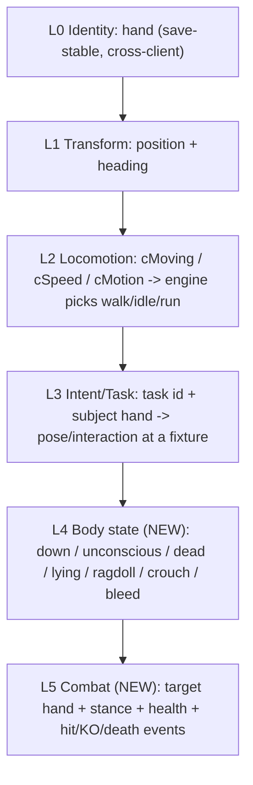

# Kenshi Co-op: The Intent-Replication Framework

> Status: Design framework (forward-looking). Generalizes the two big wins of
> Phase 2 - the v4 locomotion mirror and the sit/stand task-pose sync - into the
> single principle the rest of the project should be built on. Companion to
> `MASTER_PLAN.md` (charter) and `POSTMORTEM.md` (what we learned getting here).
> Grounded in the current code: `src/netproto/Wire.h` (the wire shape),
> `src/plugin/sync/Replicator.cpp` (apply regimes), `src/plugin/game/Engine.h`
> (the engine levers).

## The core principle: replicate causes, not effects

Every replicated behavior the join renders is produced by **the join's own engine**
from a small set of replicated *inputs*. We never stream the animation itself
(clip id + phase). We stream the **causes** - identity, transform, locomotion
state, AI intent, and body state - and let the local engine compute the matching
animation, then we quiet the local AI so it does not override the result, and we
keep an authority guard so divergence is bounded.

This was not the original plan - we arrived at it empirically, after two
transform-only / clip-level dead-ends (see `POSTMORTEM.md`):

- Streaming a **transform** for a resting NPC produced the wrong pose (it stood
  where the host sat).
- Streaming a **clip** directly was not viable - idle/sit/stand are not slave
  animations (`runSlaveAnim` logged zero calls) and `AnimationClass` is opaque.
- Streaming the **cause** - the locomotion scalars (v4), and then the AI **task +
  subject** - produced the correct pose *and* position, cheaply.

Why this matters for the whole project: the per-entity wire cost is roughly
**constant as animation variety grows**. A seated pose is ~2 bytes of task id plus
a 20-byte subject hand, regardless of how complex the seated animation is, and it
is **idempotent** (re-applied every tick, so packet loss self-heals). Laying, KO,
crafting, and combat are all the same shape with a different lever - so the
framework scales without a bandwidth blow-up or a bespoke netcode path per
animation.

## The layered model

`EntityState` in `src/netproto/Wire.h` and the regime selection in
`Replicator::applyTargets` -> `applyRest` already implement layers 0-3. The
framework names them and adds two:

- **L0 Identity (`hand`).** The five-field Kenshi `hand` is save-stable and
  identical across machines that load the same save, so a streamed entity resolves
  to the real local `Character`/`RootObject`. This is the cornerstone - it is what
  lets us "drive the real local object" instead of puppeting a ghost. DONE.
- **L1 Transform.** Position + heading. Authoritative while a body is in motion or
  at a held rest. DONE (`applyRaw`, `park`).
- **L2 Locomotion.** `cMoving` / `cSpeed` / `cMotion`: the engine's `AnimationClass`
  selects walk/idle/run from these. We mirror them as the last write of the frame
  for at-rest bodies, and for moving bodies we let the engine set them itself by
  driving a real walk. DONE (v4 mirror + walk-drive).
- **L3 Intent/Task.** `task` (engine `TaskType`) + the subject `hand` the task
  targets. The join reproduces the pose/interaction at the *same* fixture. DONE for
  sit/operate; crafting/gathering is the next instance (same lever).
- **L4 Body state (NEW).** Poses that are not a task at a fixture - knocked out,
  unconscious, dead, lying down, ragdolling, crouched, bleeding. These cannot be
  expressed as a task+subject and need a compact state field plus an apply path
  that sets the body state directly with NO pathing.
- **L5 Combat (NEW).** The interactive, fast-changing state of a fight: combat
  target hand, stance, health, plus one-shot events (hit reaction, the instant of
  KO/death). Host-authoritative resolution.

## The three levers every class needs

Each layer/class is applied on the join with the same triplet (this is the
doctrine `POSTMORTEM.md` records, named here so new classes follow it):

1. **Apply lever** - drive or inject the input. Existing primitives in
   `Engine.h`: `applyRaw` (teleport), `walkTo`/`park` (locomotion),
   `applyTaskOrder` (player-order pose at a fixture), `applyMotion` (mirror
   locomotion scalars).
2. **Quieting lever** - stop the local AI from overriding the input. Existing
   primitives: `clearGoals`, AI-suspend (`addAiSuspend`), `detachFromTownAI` +
   order (sitters), `endAction` + relapse re-quiet (standers). The sit/stand work
   proved these are **not interchangeable** - see the asymmetry rule below.
3. **Authority/drift guard** - bound divergence. Existing: `TASK_DRIFT_MAX`
   abandon-to-park, `SNAP_DIST` hard teleport, `enforceHostAuthority`
   suppress/restore for world NPCs the host is/ is not streaming.

### The asymmetry rule (the hardest-won lesson)

The **same lever applied to the wrong class backfires.** Concretely, from the
sit/stand iterations:

- Sitters need `detachFromTownAI` + a persistent location-bound ORDER. Detach is
  safe *only because* the order immediately re-anchors them.
- Standers must **not** be detached: `separateIntoMyOwnSquad` changes the body's
  container, which changes its cross-client `hand` key, so the host can no longer
  match it and `enforceHostAuthority` suppresses it (it goes ABSENT). Standers get
  `endAction` only.

So the framework is explicitly a taxonomy of **(behavior class -> lever set)**, not
one universal code path. Adding a new class means choosing its lever set, not
reusing the last one blindly.

## Behavior taxonomy

- **Locomotion (moving).** Lever: lead-point walk-drive (`walkTo`) + catch-up
  speed; engine animates the gait itself. Guard: `SNAP_DIST` teleport. STATUS:
  DONE.
- **Fixture-bound task pose** (sit, operate, **craft, gather**). Lever:
  `detachFromTownAI` + `applyTaskOrder(subject)` so the body walks-and-poses at the
  exact fixture (a player order, not the autonomous goal that re-searches for any
  nearby fixture). Guard: `TASK_DRIFT_MAX` abandon. STATUS: DONE for sit/operate;
  crafting/gathering is the spearhead.
- **Node-bound idle pose** (stand-at-node). Lever: `endAction` + `park` + re-quiet
  on relapse (re-`endAction` only when the body reports a walk motion while held).
  No detach. STATUS: DONE.
- **State-driven pose, no subject** (laying, unconscious, KO, dead, ragdoll).
  Lever: set the body state directly from an L4 field; no task, no pathing. Guard:
  hold transform; do not walk-drive a downed body. STATUS: NEW (L4).
- **Interactive fast state** (combat). Lever: host-authoritative target/stance/
  health (L5 sub-batch) + reliable one-shot events for hit/KO/death. Guard: the
  host owns the outcome; the join renders reactions and never resolves a hit
  locally. STATUS: NEW (L5).

## Network ramifications

The headline is positive: streaming causes keeps the per-entity wire cost roughly
constant and the state idempotent (loss-tolerant). The framework changes the wire
in three bounded ways, plus two scaling levers we get for free.

### Wire changes

- **Add a body-state field to `EntityState` (L4).** A `u16` flag set
  (down / unconscious / dead / lying / ragdoll / crouched / bleeding) covers all
  no-subject poses in a couple of bytes. This is a packed-struct change, so it is
  backward-incompatible: **bump `PROTOCOL_VERSION`** in `src/netproto/Wire.h` (the
  handshake rejects mismatches, which is the desired behavior - no half-upgraded
  sessions).
- **Add a reliable event sub-channel (`PKT_EVENT`).** Some behaviors are *events*,
  not *states*: the instant of death/KO, a hit reaction, a gesture, a recruit. The
  current `PKT_ENTITY_BATCH` is 20 Hz **unreliable** - correct for continuous state
  (a dropped frame self-heals next tick) but wrong for a one-shot (a dropped death
  event leaves a body alive on the join). Add a small **reliable, sequenced**
  `PKT_EVENT` carried on ENet's reliable channel alongside the unreliable state
  batch. State stays idempotent on the unreliable channel; transitions that must
  not be lost go on the reliable channel.
- **Carry combat state as an optional sub-batch (L5), not as bloat on every
  `EntityState`.** Target / stance / health only matter for entities currently in
  combat. Widening every entity by ~10 bytes for a field that is null 95% of the
  time wastes the datagram budget; instead send a separate optional batch keyed by
  `hand`, present only for combatants.

### Scaling levers we already have

- **Divergence-gated authority.** `applyTargets` already logs a `[gate]` metric:
  host `rawTask` vs the join's own local task for each NPC. High agreement means
  the local AI is independently doing what the host is doing, so we could *trust
  local simulation* there and actively drive only on divergence. This reduces the
  set we must drive, cuts redundant correction, and degrades gracefully under
  latency/load. It is currently logged-not-acted-on; the framework promotes it to a
  first-class authority mode.
- **Rate tiers / interest LOD.** Keep locomotion + pose at 20 Hz; give nearby
  combatants a faster or event-driven tier; drop the rate for distant entities.
  Interest management (`captureNpcs` / `listNpcs`) already bounds the active set, so
  this is a per-tier cadence on top of an existing cap.

### What does NOT change

- **Identity stays `hand`-based** for every layer, including L4/L5. A combat target
  is referenced by the target's `hand`, not a pointer or a network id.
- **The transport stays ENet 20 Hz** for state; we only add a reliable channel for
  events, which ENet already supports.
- **Shared-save remains mandatory** - resolve-by-`hand` only works when both
  clients load the identical save.

## Scaling validation: the per-class conformance oracle

The sit/stand work produced a reusable validation pattern; the framework makes it
the standard for every new class. The pelvis / `isIdle` / `isCrouched` / `task`
oracle (`engine::readPoseState` in `Engine.h`, `Compare-NpcPoseState` in
`scripts/run_test.ps1`) is one instance of a general recipe.

Every new behavior class ships with a **conformance triplet**:

1. **Host ground-truth read** - the authoritative engine state for that class on
   the host (e.g. `task` + subject for poses; an `isDown`/health read for L4; a
   combat-target read for L5).
2. **Join rendered-body read** - read the *result on the rendered body*, not the
   field we wrote, so the check cannot self-confirm. (The pose oracle reads the
   `Bip01 Pelvis` world height off the animated skeleton precisely so a written
   `task` flag cannot fake a PASS.)
3. **Tolerance comparator + deterministic scenario** - a compiled `Scenario`
   (`src/plugin/test/Scenario.h`, driven via `ScenarioApi.h`) that sets up the
   state on both clients, plus a comparator in `run_test.ps1` that time-aligns the
   host and join reads and emits a RED/GREEN verdict (the existing `CROSSCHECK` /
   pose-state machinery).

This recipe is what lets us add a class and *know* it works without relying on
eyeballing a single screenshot. Each new class adds: a host read, a join
rendered read, a tolerance, and a baked scenario.

## Spearhead: crafting / gathering (the second proof case)

Crafting/gathering is the lowest-risk next class because it is a **fixture-bound
task pose** - the exact class the sit lever already solves. Implementing it proves
the framework's central claim (a new behavior is a new lever-set instance, not new
netcode), and it is high-value (bases, production, mining, farming are core Kenshi
loops).

### Why it should reuse the sit lever almost verbatim

A crafting/mining/farming NPC has an AI `task` whose subject is a work station
(research bench, smithy, ore node, farm plot). That is structurally identical to
`SIT_AROUND` on a stool: a task + a subject `hand`. So the apply path is the
existing `detachFromTownAI` + `applyTaskOrder(subject)` - detach so the town-AI
stops re-tasking, then a player order pinning the body to *this* station instead of
letting the autonomous goal re-search for any station.

### Design steps (no code in this doc)

- **Enumerate the task ids.** Identify the crafting / mining / farming `TaskType`s
  (the same enum that gave `SIT_AROUND`=87, `STAND_AT_NODE`=51) and confirm which
  are fixture-bound (reproducible via order) vs node-anchored (need the
  `endAction`/local-AI path instead). `engine::isNodeAnchoredPose` is the existing
  classifier to extend.
- **Confirm subject-hand resolution for non-`Building` subjects.** Sit subjects are
  furniture `Building`s. Work subjects may be **resource entities** (an ore
  deposit, a plant) rather than buildings - confirm these expose a save-stable
  `hand` that `engine::resolve` can turn into a local `RootObject`. THIS IS THE
  MAIN OPEN RISK; if a resource node has no stable cross-client hand, that subtype
  falls back to position-hold + the work animation via locomotion mirror.
- **Apply + guard.** Reuse `applyRest`'s order path and `TASK_DRIFT_MAX` abandon
  unchanged; expect the body to walk to and pose at the station.
- **Oracle.** Conformance triplet for this class: subject resolves on the join +
  body is at the station (position tolerance) + the work animation's pelvis/anim
  signature matches (a working body has a distinct stance from idle/seated).
- **Scenario.** Bake a save with a work station + a character assigned to craft
  there (the same "bake a deterministic scene then SAVE" method used for the seat
  scenes), then a `craft_sync` scenario that flips RED->GREEN like
  `squad_spawn_sync` did.

### Open risks to carry into implementation (not solved here)

- **Roaming gathering.** Some gathering walks between nodes (cut tree -> haul ->
  next tree): a locomotion + task interplay, not a static pose. The framework
  handles this as "L2 while moving, L3 at the node" - but the hand-off cadence
  needs validation.
- **Resource-node identity.** As above: resource subjects may not carry a stable
  cross-client `hand`.
- **Multi-stage jobs.** A craft that consumes inputs and produces outputs touches
  L4 world-object state (inventory), which is Phase 4 - the *pose* syncs first;
  the *production result* is a later layer.

## Re-prioritized roadmap

This framework reorders the `MASTER_PLAN.md` roadmap from "NPC fidelity then
combat" into a sequence of behavior classes ordered by ascending risk, each one a
new lever-set instance validated by its own conformance oracle:

- **Phase 3 - Intent-replication framework** (supersedes the old "NPC fidelity"):
  - **3a Crafting/gathering** [DONE] - reuse the fixture-task lever; lowest risk;
    proves framework reuse. Validated via `craft_order` (live idle->operating order).
  - **3b Body-state layer (L4)** [DONE] - laying / unconscious / KO / death /
    ragdoll. Added the `bodyState` field (continuous, unreliable, self-healing) AND
    the reliable event channel (`PKT_EVENT`: KO/death/revive transitions on ENet's
    reliable channel). Validated via `down_order` (live upright->down) and
    `death_order` (host kills subject -> join receives the reliable `EVT_DEATH`
    *even under 30% packet loss + latency*, because the event bypasses the
    unreliable-batch drop). No pathing.
  - **3c Combat (L5)** [DONE] - target / combat intent + reliable hit/KO/death events
    + host-authoritative outcome & attribution. Both stated dependencies (3b body
    state + the reliable event channel) were in place. Validated via `combat_probe`
    (host combat-state read), `combat_order` (live melee intent so a fight that
    starts *after* the join loads renders), and `combat_kill` (deterministic KO with
    sticky time-windowed attacker attribution). Hit/KO/death reuse `PKT_EVENT`;
    intent rides `TASK_COMBAT_MELEE`.
- **Phase 3.5 - Bidirectional per-tab ownership (presence keystone)** [DONE] -
  ownership partitioned by Kenshi squad tab (= the member's `hand` CONTAINER rank),
  with `publishOwned` + `applyTargets` running on BOTH clients and a drive-exclusion
  guard on each side's own published hands. This is the layer that gives the guest
  real agency over its own squad. Validated via `coop_presence` (bidirectional
  cross-check, 0 ms + WAN) and manual control on `squad1`. See `POSTMORTEM.md`
  addendum "Bidirectional per-tab ownership".
- **Phase 4 - World objects** - inventory, buildings, items in the active zone
  (the production *results* of 3a, plus general object state).
- **Phase 5 - Hardening** - interpolation buffer for real latency/jitter, event
  ack/resend, reconnect, rate limiting, anti-crash guards.

## Doctrine (additions for the framework era)

These extend the numbered doctrine in `POSTMORTEM.md`:

14. **Replicate causes, not effects.** Stream identity + transform + locomotion +
    intent + body state; let the local engine produce the animation. Never stream
    clips/phases. This keeps the wire constant-cost per entity and idempotent.
15. **A new behavior is a new (class -> lever-set) entry, not new netcode.** Pick
    its apply lever, its quieting lever, and its guard; do not reuse the previous
    class's lever blindly (the sit/stand asymmetry).
16. **State on the unreliable channel; transitions on the reliable channel.**
    Continuous state self-heals at 20 Hz; one-shot events (death, KO, hit) must not
    be lost - carry them on `PKT_EVENT`.
17. **Every class ships its conformance oracle.** Host truth + a rendered-body read
    (not the field we wrote) + a tolerance + a deterministic scenario. No class is
    "done" on a single screenshot.
18. **Prefer divergence-gated authority where the local AI already agrees.** Use
    the `[gate]` signal to drive only what diverges; it scales the active driven
    set down and degrades gracefully.
