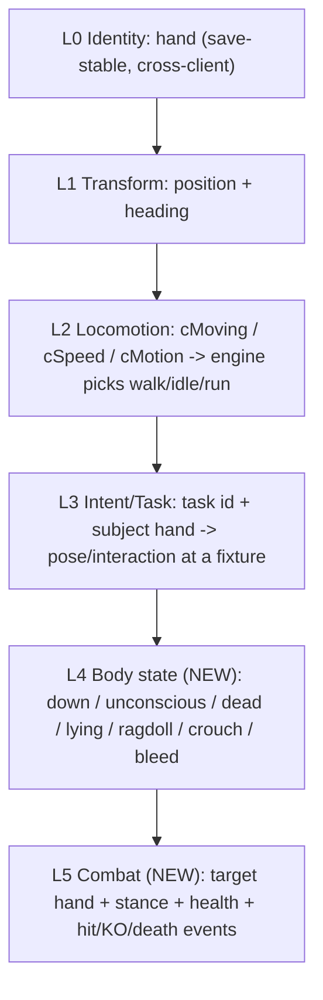

# Kenshi Co-op: The Intent-Replication Framework

> Status: Design framework (forward-looking). Generalizes the two big wins of
> Phase 2 - the v4 locomotion mirror and the sit/stand task-pose sync - into the
> single principle the rest of the project should be built on. Companion to
> `MASTER_PLAN.md` (charter) and `POSTMORTEM.md` (what we learned getting here).
> Grounded in the current code: `src/netproto/Wire.h` (the wire shape),
> `src/plugin/sync/Replicator.cpp` (apply regimes), `src/plugin/game/Engine.h`
> (the engine levers).

## The core principle: replicate causes, not effects

Every replicated behavior the join renders is produced by **the join's own engine**
from a small set of replicated *inputs*. We never stream the animation itself
(clip id + phase). We stream the **causes** - identity, transform, locomotion
state, AI intent, and body state - and let the local engine compute the matching
animation, then we quiet the local AI so it does not override the result, and we
keep an authority guard so divergence is bounded.

This was not the original plan - we arrived at it empirically, after two
transform-only / clip-level dead-ends (see `POSTMORTEM.md`):

- Streaming a **transform** for a resting NPC produced the wrong pose (it stood
  where the host sat).
- Streaming a **clip** directly was not viable - idle/sit/stand are not slave
  animations (`runSlaveAnim` logged zero calls) and `AnimationClass` is opaque.
- Streaming the **cause** - the locomotion scalars (v4), and then the AI **task +
  subject** - produced the correct pose *and* position, cheaply.

Why this matters for the whole project: the per-entity wire cost is roughly
**constant as animation variety grows**. A seated pose is ~2 bytes of task id plus
a 20-byte subject hand, regardless of how complex the seated animation is, and it
is **idempotent** (re-applied every tick, so packet loss self-heals). Laying, KO,
crafting, and combat are all the same shape with a different lever - so the
framework scales without a bandwidth blow-up or a bespoke netcode path per
animation.

## The layered model

`EntityState` in `src/netproto/Wire.h` and the regime selection in
`Replicator::applyTargets` -> `applyRest` already implement layers 0-3. The
framework names them and adds two:

- **L0 Identity (`hand`).** The five-field Kenshi `hand` is save-stable and
  identical across machines that load the same save, so a streamed entity resolves
  to the real local `Character`/`RootObject`. This is the cornerstone - it is what
  lets us "drive the real local object" instead of puppeting a ghost. DONE.
- **L1 Transform.** Position + heading. Authoritative while a body is in motion or
  at a held rest. DONE (`applyRaw`, `park`).
- **L2 Locomotion.** `cMoving` / `cSpeed` / `cMotion`: the engine's `AnimationClass`
  selects walk/idle/run from these. We mirror them as the last write of the frame
  for at-rest bodies, and for moving bodies we let the engine set them itself by
  driving a real walk. DONE (v4 mirror + walk-drive).
- **L3 Intent/Task.** `task` (engine `TaskType`) + the subject `hand` the task
  targets. The join reproduces the pose/interaction at the *same* fixture. DONE for
  sit/operate; crafting/gathering is the next instance (same lever).
- **L4 Body state (NEW).** Poses that are not a task at a fixture - knocked out,
  unconscious, dead, lying down, ragdolling, crouched, bleeding. These cannot be
  expressed as a task+subject and need a compact state field plus an apply path
  that sets the body state directly with NO pathing.
- **L5 Combat (NEW).** The interactive, fast-changing state of a fight: combat
  target hand, stance, health, plus one-shot events (hit reaction, the instant of
  KO/death). Host-authoritative resolution.

## The three levers every class needs

Each layer/class is applied on the join with the same triplet (this is the
doctrine `POSTMORTEM.md` records, named here so new classes follow it):

1. **Apply lever** - drive or inject the input. Existing primitives in
   `Engine.h`: `applyRaw` (teleport), `walkTo`/`park` (locomotion),
   `applyTaskOrder` (player-order pose at a fixture), `applyMotion` (mirror
   locomotion scalars).
2. **Quieting lever** - stop the local AI from overriding the input. Existing
   primitives: `clearGoals`, AI-suspend (`addAiSuspend`), `detachFromTownAI` +
   order (sitters), `endAction` + relapse re-quiet (standers). The sit/stand work
   proved these are **not interchangeable** - see the asymmetry rule below.
3. **Authority/drift guard** - bound divergence. Existing: `TASK_DRIFT_MAX`
   abandon-to-park, `SNAP_DIST` hard teleport, `enforceHostAuthority`
   suppress/restore for world NPCs the host is/ is not streaming.

### The asymmetry rule (the hardest-won lesson)

The **same lever applied to the wrong class backfires.** Concretely, from the
sit/stand iterations:

- Sitters need `detachFromTownAI` + a persistent location-bound ORDER. Detach is
  safe *only because* the order immediately re-anchors them.
- Standers must **not** be detached: `separateIntoMyOwnSquad` changes the body's
  container, which changes its cross-client `hand` key, so the host can no longer
  match it and `enforceHostAuthority` suppresses it (it goes ABSENT). Standers get
  `endAction` only.

So the framework is explicitly a taxonomy of **(behavior class -> lever set)**, not
one universal code path. Adding a new class means choosing its lever set, not
reusing the last one blindly.

## Behavior taxonomy

- **Locomotion (moving).** Lever: lead-point walk-drive (`walkTo`) + catch-up
  speed; engine animates the gait itself. Guard: `SNAP_DIST` teleport. STATUS:
  DONE.
- **Fixture-bound task pose** (sit, operate, **craft, gather**). Lever:
  `detachFromTownAI` + `applyTaskOrder(subject)` so the body walks-and-poses at the
  exact fixture (a player order, not the autonomous goal that re-searches for any
  nearby fixture). Guard: `TASK_DRIFT_MAX` abandon. STATUS: DONE for sit/operate;
  crafting/gathering is the spearhead.
- **Node-bound idle pose** (stand-at-node). Lever: `endAction` + `park` + re-quiet
  on relapse (re-`endAction` only when the body reports a walk motion while held).
  No detach. STATUS: DONE.
- **State-driven pose, no subject** (laying, unconscious, KO, dead, ragdoll).
  Lever: set the body state directly from an L4 field; no task, no pathing. Guard:
  hold transform; do not walk-drive a downed body. STATUS: NEW (L4).
- **Interactive fast state** (combat). Lever: host-authoritative target/stance/
  health (L5 sub-batch) + reliable one-shot events for hit/KO/death. Guard: the
  host owns the outcome; the join renders reactions and never resolves a hit
  locally. STATUS: NEW (L5).

## Network ramifications

The headline is positive: streaming causes keeps the per-entity wire cost roughly
constant and the state idempotent (loss-tolerant). The framework changes the wire
in three bounded ways, plus two scaling levers we get for free.

### Wire changes

- **Add a body-state field to `EntityState` (L4).** A `u16` flag set
  (down / unconscious / dead / lying / ragdoll / crouched / bleeding) covers all
  no-subject poses in a couple of bytes. This is a packed-struct change, so it is
  backward-incompatible: **bump `PROTOCOL_VERSION`** in `src/netproto/Wire.h` (the
  handshake rejects mismatches, which is the desired behavior - no half-upgraded
  sessions).
- **Add a reliable event sub-channel (`PKT_EVENT`).** Some behaviors are *events*,
  not *states*: the instant of death/KO, a hit reaction, a gesture, a recruit. The
  current `PKT_ENTITY_BATCH` is 20 Hz **unreliable** - correct for continuous state
  (a dropped frame self-heals next tick) but wrong for a one-shot (a dropped death
  event leaves a body alive on the join). Add a small **reliable, sequenced**
  `PKT_EVENT` carried on ENet's reliable channel alongside the unreliable state
  batch. State stays idempotent on the unreliable channel; transitions that must
  not be lost go on the reliable channel.
- **Carry combat state as an optional sub-batch (L5), not as bloat on every
  `EntityState`.** Target / stance / health only matter for entities currently in
  combat. Widening every entity by ~10 bytes for a field that is null 95% of the
  time wastes the datagram budget; instead send a separate optional batch keyed by
  `hand`, present only for combatants.

### Scaling levers we already have

- **Divergence-gated authority.** `applyTargets` already logs a `[gate]` metric:
  host `rawTask` vs the join's own local task for each NPC. High agreement means
  the local AI is independently doing what the host is doing, so we could *trust
  local simulation* there and actively drive only on divergence. This reduces the
  set we must drive, cuts redundant correction, and degrades gracefully under
  latency/load. It is currently logged-not-acted-on; the framework promotes it to a
  first-class authority mode.
- **Rate tiers / interest LOD.** Keep locomotion + pose at 20 Hz; give nearby
  combatants a faster or event-driven tier; drop the rate for distant entities.
  Interest management (`captureNpcs` / `listNpcs`) already bounds the active set, so
  this is a per-tier cadence on top of an existing cap.

### What does NOT change

- **Identity stays `hand`-based** for every layer, including L4/L5. A combat target
  is referenced by the target's `hand`, not a pointer or a network id.
- **The transport stays ENet 20 Hz** for state; we only add a reliable channel for
  events, which ENet already supports.
- **Shared-save remains mandatory** - resolve-by-`hand` only works when both
  clients load the identical save.

## Scaling validation: the per-class conformance oracle

The sit/stand work produced a reusable validation pattern; the framework makes it
the standard for every new class. The pelvis / `isIdle` / `isCrouched` / `task`
oracle (`engine::readPoseState` in `Engine.h`, `Compare-NpcPoseState` in
`scripts/run_test.ps1`) is one instance of a general recipe.

Every new behavior class ships with a **conformance triplet**:

1. **Host ground-truth read** - the authoritative engine state for that class on
   the host (e.g. `task` + subject for poses; an `isDown`/health read for L4; a
   combat-target read for L5).
2. **Join rendered-body read** - read the *result on the rendered body*, not the
   field we wrote, so the check cannot self-confirm. (The pose oracle reads the
   `Bip01 Pelvis` world height off the animated skeleton precisely so a written
   `task` flag cannot fake a PASS.)
3. **Tolerance comparator + deterministic scenario** - a compiled `Scenario`
   (`src/plugin/test/Scenario.h`, driven via `ScenarioApi.h`) that sets up the
   state on both clients, plus a comparator in `run_test.ps1` that time-aligns the
   host and join reads and emits a RED/GREEN verdict (the existing `CROSSCHECK` /
   pose-state machinery).

This recipe is what lets us add a class and *know* it works without relying on
eyeballing a single screenshot. Each new class adds: a host read, a join
rendered read, a tolerance, and a baked scenario.

## Spearhead: crafting / gathering (the second proof case)

Crafting/gathering is the lowest-risk next class because it is a **fixture-bound
task pose** - the exact class the sit lever already solves. Implementing it proves
the framework's central claim (a new behavior is a new lever-set instance, not new
netcode), and it is high-value (bases, production, mining, farming are core Kenshi
loops).

### Why it should reuse the sit lever almost verbatim

A crafting/mining/farming NPC has an AI `task` whose subject is a work station
(research bench, smithy, ore node, farm plot). That is structurally identical to
`SIT_AROUND` on a stool: a task + a subject `hand`. So the apply path is the
existing `detachFromTownAI` + `applyTaskOrder(subject)` - detach so the town-AI
stops re-tasking, then a player order pinning the body to *this* station instead of
letting the autonomous goal re-search for any station.

### Design steps (no code in this doc)

- **Enumerate the task ids.** Identify the crafting / mining / farming `TaskType`s
  (the same enum that gave `SIT_AROUND`=87, `STAND_AT_NODE`=51) and confirm which
  are fixture-bound (reproducible via order) vs node-anchored (need the
  `endAction`/local-AI path instead). `engine::isNodeAnchoredPose` is the existing
  classifier to extend.
- **Confirm subject-hand resolution for non-`Building` subjects.** Sit subjects are
  furniture `Building`s. Work subjects may be **resource entities** (an ore
  deposit, a plant) rather than buildings - confirm these expose a save-stable
  `hand` that `engine::resolve` can turn into a local `RootObject`. THIS IS THE
  MAIN OPEN RISK; if a resource node has no stable cross-client hand, that subtype
  falls back to position-hold + the work animation via locomotion mirror.
- **Apply + guard.** Reuse `applyRest`'s order path and `TASK_DRIFT_MAX` abandon
  unchanged; expect the body to walk to and pose at the station.
- **Oracle.** Conformance triplet for this class: subject resolves on the join +
  body is at the station (position tolerance) + the work animation's pelvis/anim
  signature matches (a working body has a distinct stance from idle/seated).
- **Scenario.** Bake a save with a work station + a character assigned to craft
  there (the same "bake a deterministic scene then SAVE" method used for the seat
  scenes), then a `craft_sync` scenario that flips RED->GREEN like
  `squad_spawn_sync` did.

### Open risks to carry into implementation (not solved here)

- **Roaming gathering.** Some gathering walks between nodes (cut tree -> haul ->
  next tree): a locomotion + task interplay, not a static pose. The framework
  handles this as "L2 while moving, L3 at the node" - but the hand-off cadence
  needs validation.
- **Resource-node identity.** As above: resource subjects may not carry a stable
  cross-client `hand`.
- **Multi-stage jobs.** A craft that consumes inputs and produces outputs touches
  L4 world-object state (inventory), which is Phase 4 - the *pose* syncs first;
  the *production result* is a later layer.

## Re-prioritized roadmap

> Forward queue: the remaining NOT-yet-synced world state (economy, recruitment,
> factions, calendar, buildings, world events, needs, session flow) lives in
> [SYNC_GAPS.md](SYNC_GAPS.md) - a prioritized living roadmap with symptom /
> root cause / candidate mechanism per gap. The phases below are the original
> framework build-out, now largely DONE.

This framework reorders the `MASTER_PLAN.md` roadmap from "NPC fidelity then
combat" into a sequence of behavior classes ordered by ascending risk, each one a
new lever-set instance validated by its own conformance oracle:

- **Phase 3 - Intent-replication framework** (supersedes the old "NPC fidelity"):
  - **3a Crafting/gathering** [DONE] - reuse the fixture-task lever; lowest risk;
    proves framework reuse. Validated via `craft_order` (live idle->operating order).
  - **3b Body-state layer (L4)** [DONE] - laying / unconscious / KO / death /
    ragdoll. Added the `bodyState` field (continuous, unreliable, self-healing) AND
    the reliable event channel (`PKT_EVENT`: KO/death/revive transitions on ENet's
    reliable channel). Validated via `down_order` (live upright->down) and
    `death_order` (host kills subject -> join receives the reliable `EVT_DEATH`
    *even under 30% packet loss + latency*, because the event bypasses the
    unreliable-batch drop). No pathing.
  - **3c Combat (L5)** [DONE] - target / combat intent + reliable hit/KO/death events
    + host-authoritative outcome & attribution. Both stated dependencies (3b body
    state + the reliable event channel) were in place. Validated via `combat_probe`
    (host combat-state read), `combat_order` (live melee intent so a fight that
    starts *after* the join loads renders), and `combat_kill` (deterministic KO with
    sticky time-windowed attacker attribution). Hit/KO/death reuse `PKT_EVENT`;
    intent rides `TASK_COMBAT_MELEE`.
- **Phase 3.5 - Bidirectional per-tab ownership (presence keystone)** [DONE] -
  ownership partitioned by Kenshi squad tab (= the member's `hand` CONTAINER rank),
  with `publishOwned` + `applyTargets` running on BOTH clients and a drive-exclusion
  guard on each side's own published hands. This is the layer that gives the guest
  real agency over its own squad. Validated via `coop_presence` (bidirectional
  cross-check, 0 ms + WAN) and manual control on `squad1`. See `POSTMORTEM.md`
  addendum "Bidirectional per-tab ownership".
- **Phase 4 - World objects** - inventory, buildings, items in the active zone
  (the production *results* of 3a, plus general object state).
  - **4a Inventory / container-contents (content-snapshot/reconcile)** [DONE] -
    runtime-minted items (craft output, loot) have HOST-ONLY hands that don't resolve
    on the join, so item objects are NOT driven by `hand`. Instead the host streams a
    container's CONTENTS as a description (template `stringID` + `itemType` + quantity
    + quality) keyed by the CONTAINER's stable `hand`, and the join RECONSTRUCTS items
    locally (`createItem`+`tryAddItem` for shortfalls, `removeItemAutoDestroy` for
    excess) to match - idempotent + loss-tolerant. Rides the RELIABLE channel on a
    content-hash change (+ periodic safety resend). v1 anchors on the leader's own
    inventory (a save-stable container that accepts arbitrary items); host-authoritative
    (`applyInventories` never reconciles a container the client authors). Validated via
    `inv_order` (host live-add, host/join final-hash match, 0 ms + WAN 80/30/30% - the
    add survives loss because the snapshot is reliable) plus the existing-scenario
    regressions (`npc_sync`/`combat_kill`/`coop_presence`) staying green. **Now
    BIDIRECTIONAL:** each client authors the inventory of every squad member it owns
    (the `ownHands_` tab-rank partition - host tab 0, join tab 1) and reconciles the
    peer's; `publishInventories` is gated behind `invSync`. Validated via `inv_bidir`
    (host AND join each ADD-then-REMOVE their owned container; per-rank convergence both
    ways with distinct net deltas) at 0 ms + WAN 120/40/30%. Doctrine 23. **Now covers
    EQUIPPED gear (ALL slots):** worn gear lives in equipment SECTIONS, not the loose
    `_allItems` list, so the snapshot walks `getAllSections()` and captures every section
    flagged `isAnEquippedItemSection`, tagging each entry `equipped`+`slot` (protocol v6).
    Walking all sections covers every armour piece, belt, and a worn backpack. WEAPONS need
    more: worn weapons can live outside `getAllSections()` entirely - the sheathed weapon
    sits in a `hip`/`back` section, but the HELD weapon is tracked only by
    `getPrimaryWeapon()`/`getSecondaryWeapon()`. So the snapshot ALSO reads those two
    accessors and appends any worn weapon, deduped by `(stringID,itemType)` against the
    section-captured equipped entries (the sheathed weapon appears in both as two distinct
    `Item*`, so pointer dedup double-counts - key on template). Without the accessors, a
    re-equipped weapon (routed to the held slot) vanished from the snapshot and never
    replicated. Reconcile keys on `(stringID,itemType,equipped)` so a worn item and a loose
    copy converge independently (unequip/drop now removes the peer's worn copy - the case
    loose-only sync silently missed). Validated via `inv_equip` (each side unequips a
    real save-loaded worn item; per-rank worn-count drop + convergence both ways) at
    0 ms + WAN 80/20/1%. **Up path (re-equip) now works too:** an equipped<->loose split
    change on a template whose TOTAL count is unchanged reconciles as an in-place MOVE of
    the REAL item - UP = `equipItem` on an existing loose copy; DOWN = detach +
    re-home into a loose (non-equip) section's `addItem` (NOT `tryAddItem`, which
    auto-re-equips). This sidesteps the fabricated-equip discard (d25): a genuinely-new
    worn item with no loose copy is still best-effort `create+equip`. Validated via
    `inv_reequip` (unequip a real worn item to loose, then re-equip it; per-rank
    dip-then-restore + convergence both ways). Doctrine 25. **Publish settle-debounce
    (removal-aware):** `publishInventories` only sends a changed fingerprint after it stays
    STABLE for a settle window, and the window depends on the change: additions and
    equip<->loose MOVES (entry count unchanged) use a fast `INV_SETTLE_MS` (350 ms), while a
    count DECREASE (`n < lastSentN`) uses `INV_REMOVE_SETTLE_MS` (1800 ms). Mid-drag the UI
    holds the dragged item on the CURSOR, so the inventory briefly reports it FULLY GONE - and
    a *human* re-equip holds that for ~960 ms (measured), far past a flat 350 ms. Without the
    long removal window the peer acts on that transient by DESTROYING the worn item, and it
    cannot refabricate a worn weapon (createItemAndAdd fails for weapons; equipped fabrication
    is non-persistent, d25), losing it permanently. Gating only DECREASES on the long window
    swallows the cursor-hold (peer keeps + MOVES its real item) while keeping equip/unequip
    snappy; the cost is a ~1.8 s lag before a genuine drop shows on the peer. Manually
    validated (host removals/unequips, weapon included, reflected on the join; join trace
    shows `MOVE-UP ok=1`, zero weapon REMOVE). Diagnosed with the
    `KENSHICOOP_INV_DUMP` trace (per-SEND/APPLY inventory dump + `[recon]` branch log) and
    the `inv_wpnseq` single-instance scenario that drives `applyContainerContents` through
    the exact snapshot sequence with no UI. Doctrine 26. **Weapon-SLOT fidelity:** the two
    weapon slots (`hip` = Weapon II, `back` = Weapon I) BOTH carry `limitedSlot=ATTACH_WEAPON`,
    so the `slot` field can't distinguish them and `equipItem` auto-routes a re-equipped weapon
    to the default slot. Each `InvItemEntry` now carries `section` = a 16-bit hash of the equip
    section NAME (stable cross-client), folded into `invEntryHash` (else a Weapon I<->II move
    has an unchanged fingerprint and never publishes), and `applyContainerContents` runs a
    SLOT-FIDELITY pass that MOVES the real worn weapon between weapon sections
    (`removeItemDontDestroy` + target `InventorySection::addItem`) to match the author's slot.
    Armour is untouched (unique per-slot sections). Protocol 6 -> 7. Manually validated both
    directions (one `SLOT-MOVE` per side, zero REMOVE). Doctrine 27.
  - **4b Cross-squad TRADE via the world (drop -> pickup)** [PLANNED] - a direct
    cross-squad drag is a non-atomic transfer across two authorities, so the
    snapshot/reconcile model loses items moved INTO a peer-owned container and dupes
    items moved OUT of one (doctrine 24). Route trades through host-authoritative world
    state instead: DROP removes from the owner's inventory + spawns a ground item;
    PICKUP removes the ground item + adds to the picker's inventory. Each leg is
    single-owner, so there is no race. Prereq: world/ground item sync (verify dropped
    items have stable cross-client hands, else content-snapshot a ground cell).
- **Phase 5 - Hardening** - interpolation buffer for real latency/jitter, event
  ack/resend, reconnect, rate limiting, anti-crash guards.

## Doctrine (additions for the framework era)

These extend the numbered doctrine in `POSTMORTEM.md`:

14. **Replicate causes, not effects.** Stream identity + transform + locomotion +
    intent + body state; let the local engine produce the animation. Never stream
    clips/phases. This keeps the wire constant-cost per entity and idempotent.
15. **A new behavior is a new (class -> lever-set) entry, not new netcode.** Pick
    its apply lever and its guard; do not reuse the previous class's lever blindly
    (the sit/stand asymmetry). *Amended 2026-07-05:* **AI-suspend (the
    `periodicUpdate` decision-layer detour) is the UNIVERSAL quieting layer,
    default-on for every host-driven world NPC on the join** - validated at
    parity-or-better on the pose oracles (pose_state 0.972 vs 0.962). Classes now
    differ only in their APPLY lever; the remaining per-class quieting moves
    (`endAction` relapse re-quiets, sitter `detachFromTownAI`) are measured by
    counters and pruned as the data allows.
16. **State on the unreliable channel; transitions on the reliable channel.**
    Continuous state self-heals at 20 Hz; one-shot events (death, KO, hit) must not
    be lost - carry them on `PKT_EVENT`.
17. **Every class ships its conformance oracle.** Host truth + a rendered-body read
    (not the field we wrote) + a tolerance + a deterministic scenario. No class is
    "done" on a single screenshot.
18. **Prefer divergence-gated authority where the local AI already agrees.** Use
    the `[gate]` signal to drive only what diverges; it scales the active driven
    set down and degrades gracefully. *Promoted to default 2026-07-05 (step-4
    A/B):* a world NPC whose local task has agreed with the host's `rawTask` for
    ~2 s while in position enters TRUSTED mode (no suspend, no drive, cheap
    monitor); task divergence or drift past tolerance re-engages the drive the
    same tick. Measured: trusted ~5 of 12 driven bar NPCs, grants 5-8 per run,
    tracking gates at parity. `KENSHICOOP_GATE_AUTHORITY=0` is the escape hatch.
19. **For runtime-created content, replicate the CONTAINER's contents, not the item
    objects.** Items minted at runtime (craft output, loot) have host-only `hand`s
    that don't resolve on the peer, so stream a content DESCRIPTION (template
    `stringID` + type + qty + quality) keyed by the container's stable `hand` and let
    the peer reconstruct locally to match. Gate the (reliable) send on a content hash
    so the channel stays quiet; reconcile is idempotent and loss-tolerant. (Mirrors
    doctrine 14 "replicate causes" one layer up: the container is the cause, the item
    instances are the effect.) See `POSTMORTEM.md` doctrine 23.
20. **The join's simulation of driven bodies is COSMETIC; never let it write
    authoritative state.** (2026-07-05, step 3.) Kenshi's medical model is
    local-only, so a locally-simulated melee hit on a host-driven body would
    diverge its health forever - there is no health stream to heal it. The
    `hitByMeleeAttack` detour makes every locally-simulated hit on a non-owned
    body report `HIT_MISSED` (damage guard, default-on for joins,
    `KENSHICOOP_DAMAGE_GUARD=0` to disable); real outcomes (KO/death/revive)
    arrive as reliable host events. The `damage_guard` oracle in `combat_kill`
    reads the rendered bodies' blood on both clients: host victim bleeds, join
    copy must not. Generalization: any local-only model (medical, hunger, ...)
    a cosmetic simulation could touch needs the same one-way guard.
21. **Interest is per-owned-tab-leader, and boundary membership needs
    hysteresis.** (2026-07-05, step 5.) One capture sphere per squad-tab leader
    - each side resolves the PEER's leader locally from the shared save, so the
    world keeps streaming around BOTH players when they split up (validated by
    `split_interest`; the old single-sphere design failed exactly this, spike
    16). The 96-body cap splits across spheres, merged + deduped by hand.
    Suppress an unstreamed NPC only after a sustained unstreamed run (~1 s) and
    restore only after a ~2 s streamed dwell: a hard streamed/unstreamed edge
    churned boundary NPCs (suppress/restore counters in `SCENARIO AUTH` lines
    trend this). *Amended 2026-07-06 (two suppression bugs found together):*
    (a) the hysteresis counters must be pruned by what the local enumeration
    SAW this tick, not by driven-target membership - an NPC the host NEVER
    streamed (join-local divergent spawn) was never in `targets_`, so its
    counter was erased every tick and the suppress threshold was unreachable:
    the "phantom walker on the join that never gets hidden" bug; (b) the
    "streamed" test must also match by BODY POINTER against the set applyTargets
    actually drove - a combat-driven world NPC is detached into its own squad
    (its hand CONTAINER changes), so the hand-keyed streamed-set lookup missed
    it and suppression froze copies mid-brawl once (a) let the counters run.
22. **Quieting patchwork is pruned by counters, not by faith.** (2026-07-05,
    step 2.) With AI-suspend default-on the I10/I11 relapse re-quiets and the
    sitter detach were EXPECTED to be dead code; the counters said otherwise
    (`SCENARIO QUIET relapse=449-2044` per run, both with and without
    suspension), and the once-on-rest-entry clearGoals variant regressed
    npc_sync when tried. The residual patchwork stays, the counters stay as
    permanent health telemetry, and any future deletion must show sustained
    zeros first.
23. **Medical state resolves on the victim's OWNER; driven copies are
    display-only.** (2026-07-06, player-combat/medical phases 2-3.) Kenshi's
    medical model (blood, bleed, per-limb flesh/bandaging, KO/dead flags) is
    local-only, so authority is assigned by the squad-tab partition: each
    client is the single writer for its own tab's vitals. Three cooperating
    pieces, protocol 13:
    - **Damage guard on BOTH sides** (extends doctrine 20 to the host): a
      driven peer-squad body never takes locally-simulated damage anywhere -
      the cosmetic fight the other machine renders cannot diverge it.
    - **`PKT_MEDICAL` vitals stream** (owner -> everyone, reliable,
      change-gated by a quantized FNV hash + 400 ms floor + 3 s safety
      resend): the owner publishes each owned player-squad member's vitals;
      receivers write them onto the driven copy (`writeMedical`). Player-squad
      only - world NPCs stay on the events-only model (doctrine 16).
    - **`PKT_TREATMENT` forwarding** (healer -> owner, reliable): first aid
      applied to a DRIVEN copy is detected as local bandaging rising above the
      last RECEIVED level; the resulting per-limb bandage LEVELS (not the
      per-frame call stream) go to the owner, who applies them raise-only
      (idempotent, loss-tolerant); the vitals stream mirrors the result back.
    Corollary paid for in run 014713: a seat-INJECTED driven copy holds a
    player ORDER, and player orders outrank the AI goals the combat branch
    uses - the copy sits through 15 attack orders without ever swinging. A
    driven body entering combat from a committed pose must have that order
    FLUSHED (order-path attack, `addOrder` clear=true) before the goal-path
    attack can run (`seatbrk=1` in the `[combat] order` log line).
24. **Game time is a CONSENSUS authority: effective speed = min of both
    players' requests, host-arbitrated.** (2026-07-06, protocol 14.) Each
    client simulates its own squad tab (medical, hunger, cosmetic fights), so
    divergent game speeds diverge every rate-based system. A local speed
    click is detected as a REQUEST (same own-write-vs-user-intent detection
    as the treatment detector), sent reliable (`PKT_SPEED_REQ`); the host
    computes `min(hostReq, joinReq)` - pause is speed 0, so "either can
    pause, both must raise" falls out of min semantics - capped at 1x while
    EITHER player squad is in combat (the join reports its combat bit in the
    request; the cap never force-unpauses), and broadcasts `PKT_SPEED_SET`
    (reliable, seq-guarded, 3 s safety resend).
    **Amendment (2026-07-08): the BUTTON is the vote, the ENGINE is the
    effective - captured by hooks, applied quietly.** The original
    state-diff click detector had two coupled defects: the arbitrated apply
    went through `setGameSpeed`, which also moves the UI speed buttons (your
    click always snapped back to the min - the buttons could never express a
    vote), and a click EQUAL to the current effective changed no state, so a
    stale raised vote could never be lowered (stuck vote). Now: votes are
    captured by `KenshiLib::AddHook` detours on
    `setGameSpeed`/`userPause`/`togglePause` (simulated scenario clicks,
    RE_Kenshi controls) PLUS a poll fallback - a manual session (2026-07-08)
    proved the MainBar click handler writes the speed INLINE, never reaching
    the detours. The poll reads two signals: the engine leaving the state we
    last quietly wrote (a real click / keyboard pause - the engine state IS
    the request) and the button highlight moving while the engine did NOT
    (the same-value click, and the speed-click-while-paused: clicking a
    speed button does NOT flip the engine's pause flag, so the vote's pause
    state comes from WHICH button lit - pause button = pause vote, any speed
    button = an UNPAUSE vote at that speed; reading the engine's pause flag
    there kept both clients voting pause forever). The arbitrated effective
    is applied via `writeGameSpeedQuiet` (`setFrameSpeedMultiplier` + guarded
    `userPause`), which drives the sim WITHOUT touching the buttons. Spike
    finding (speed_probe): `setFrameSpeedMultiplier` is silent, but
    `userPause` re-highlights the buttons from the effective - so the quiet
    writer snapshots the button state after each REAL user action and
    restores it after every guarded pause/unpause (`restoreVoteButtons`).
    A user click still passes through to the engine loudly; a continuous
    enforcement tick re-asserts the effective quietly on divergence
    (replaces the old same-tick snap-back) - a click is a request, never a
    local override. Unpausing restores the player's REQUESTED speed, not
    the effective (intent pause preserves the requested multiplier, the
    engine's own model). Wire protocol unchanged. Validated by `speed_sync`
    + `Test-SpeedSync` (denied lone raise, follow latency, match fraction,
    combat window, same-value vote-lowering + denied re-raise) and the
    `speed_probe` spike (quiet-write silence, intent capture, vote-highlight
    restore). `KENSHICOOP_SPEED_SYNC=0` is the escape hatch.
25. **A queued combatant is a STANCE, not a failed attack: re-issue on target
    mismatch, never on a timer against a slot-limited engine system.**
    (2026-07-06, protocol 15.) Kenshi's AttackSlotManager grants only 1-2
    attackers an active slot; the rest of an engaged crowd WAITS
    (`CIRCLE_MENACINGLY`/`WAIT_MENACINGLY`/`HESITATE` sword states). The old
    combat branch treated "not in combat mode" as "attack failed" and
    re-issued the order every 1.5 s - each re-issue a `clearGoals` AI reset,
    whose footwork drifted past the 6 u snap gate and teleported the copy
    (manual session: 173 order lines, the same 5 waiting hands re-ordered all
    fight). Five cooperating fixes:
    - **Stream the stance** (`TASK_COMBAT_WAIT` vs `TASK_COMBAT_MELEE`, read
      off `CombatClass::combatState`): a waiting copy gets the attack goal
      ONCE and menaces in the ring; only stance/target changes touch it.
    - **Read the STABLE engaged signal**: `isInCombatMode()` flickers off
      between combo sections and slot rotations, and every flicker disarmed +
      reset the peer's copies mid-fight; `CombatClass::combatModeActive` holds
      for the whole engagement (both the host capture and the join's
      local-fight read use it).
    - **Debounce the disarm** (4 s): the stance rides the lossy entity batch;
      a one-batch gap must hold the fight, not `clearGoals` + re-park.
    - **Backoff + budget the re-issues** (1.5 s doubling to 6 s, ~6 orders per
      episode, never flicker-reset): a copy that won't engage here is
      position-driven from then on, not AI-reset forever.
    - **Grade the position correction**: < 6 u the fight owns the footwork;
      6-20 u walk-converge ONLY when not locally fighting and not still
      arming (`walkTo` is the player-move path and STOMPS a pending attack
      goal - walk-driving an arming striker kept it from ever swinging, which
      broke player_combat's authoritative-damage path); > 20 u teleport, on a
      3 s cooldown (an unstickable snap re-fired ~50x/s), logged as
      `[combat] snap`.
    Validated by `combat_crowd` + `Test-CombatCrowd` (both stances streamed,
    re-issue count per hand, WAIT-stance snap count, per-hand median tracking
    with DOWN samples excluded); regressions `combat_order`, `combat_kill`,
    `player_combat` stay green.
26. **Medical truth is the FULL anatomy plus limb topology, and world-NPC
    vitals follow combat interest.** (2026-07-06, protocol 16.) Protocol 13
    streamed only blood + 4 limbs' flesh/bandaging; Kenshi tracks ~7 parts per
    human (head/chest/stomach + 4 limbs, `MedicalSystem::anatomy`) with TWO
    damage tracks each (`flesh` cut, `fleshStun` stun) - so head wounds and
    all stun damage silently diverged. Protocol 16 extends the same
    owner-authoritative machinery instead of inventing new channels:
    - **Full-anatomy snapshot** (`MedPartEntry[12]` keyed by anatomy index -
      deterministic on a shared save; partType+side echoed as a write guard):
      flesh + stun + bandaging + juryRig per part; the quantized hash and the
      treatment rise-detector cover the full list, so first aid on a HEAD
      wound forwards too.
    - **Combat-scoped world-NPC vitals** (host -> join): NPCs fighting, being
      fought, or down/dead within interest join the medical publish set
      (change-gated, 1 Hz floor, 10 s stale window). The join's copies are
      damage-guarded (doctrine 20), so the stream is the ONLY writer - a
      battered host NPC now shows its true blood on the join. KO/death
      remain event-authoritative (doctrine 16).
    - **Limb loss = reliable edge + self-healing state** (doctrine 16 shape):
      the owner emits `EVT_AMPUTATE`/`EVT_CRUSH` on a `LimbState` transition;
      the packet carries all 4 `LimbState`s + robotic-limb template sids as
      the self-heal. Peers apply via the engine's own `amputate`/`crushLimb`
      (full effect chain: mesh detach, bleed, stats) with
      `createSeveredItem=false` - only the WORLD AUTHORITY spawns the ground
      item, which replicates as an ordinary W1 world-item proxy; a JOIN-side
      amputation destroys its local duplicate and lets the host's proxy
      stream back (`LIMB-ITEM DEDUPE`).
    - **Robotic replacements** ride the same packet: `LIMB_REPLACED` + the
      prosthetic's template sid; the peer fabricates via `createItem` (the
      weapon/manufacturer lesson did NOT recur - limb templates resolve) and
      fits it with `setRobotLimbItem(isLoadingASave=true)`.
    Engine corollary: `RobotLimbs` is LAZILY allocated (null until first
    limb loss) - always read limb state through `MedicalSystem::getLimbState`
    (null robotLimbs == all-ORIGINAL); guarding on the pointer made every
    healthy character report "unknown" and no-op'd the whole channel.
    Validated by `limb_loss` (+ WAN) with `Test-LimbLoss` (stump latency,
    stickiness, severed-item convergence), `Test-NpcVitals` on `combat_kill`
    (median cross-side blood gap), and the extended `Test-MedicOrder`
    (part/stun crossing). `KENSHICOOP_MED_SYNC=0` remains the escape hatch.
27. **Character stats are owner-authoritative continuous state - and their
    staleness is a GAMEPLAY bug, not a display one.** (2026-07-06, protocol
    17.) `CharStats` (attributes, weapon/craft skills, xp) is entirely local,
    like the medical model - but unlike medical, the PEER'S engine resolves
    real outcomes with its copy of these numbers: a join-owned character
    fighting a world NPC resolves the authoritative damage on the HOST
    (doctrine 23), using the host's copy of that character's stats. Without
    sync those are the save-load values all session, so a character leveled
    mid-session fights at its old strength whenever the fight crosses the
    partition. Driven copies also accumulate junk XP from cosmetic fights
    (the damage guard blocks damage, not XP events). Protocol 17 reuses the
    medical shape wholesale:
    - **Owned player-squad members only** (`ownHands_`): each client streams
      its own tabs' `CharStats` via `PKT_STATS` (all 38 `StatsEnumerated`
      slots + xp + freeAttributePoints), change-gated on a 0.1-unit quantized
      fingerprint with a 1 s floor + 5 s safety resend - stats creep slowly,
      so the reliable channel is near-silent between level-ups.
    - **World NPCs are deliberately EXCLUDED**: their authoritative fights
      run on the host with the host's own (correct) local stats; streaming
      them would be traffic without a consumer.
    - **The receiver writes through the engine's own accessor**
      (`CharStats::getStatRef(StatsEnumerated)` - no per-field offsets), then
      calls `CharStats::periodicUpdate` so derived caches (attack/block
      speed, run speed, encumbrance) refresh immediately; `-1` fields are
      never written (the medical unreadable convention).
    - **The stream is the XP-pollution self-heal**: whatever junk a driven
      copy's cosmetic fights accrue locally, the owner's next snapshot
      overwrites.
    Known limitation (out of scope): session setup mirrors the host's save,
    so join-side gains persist only in the join's own save - cross-session
    persistence is a save/session-flow feature, not a sync-channel one.
    Validated by `stats_sync` (+ WAN) with `Test-StatsSync` (raised stats
    cross within budget, stay sticky, untouched control stat does not
    drift); regressions `coop_presence`, `player_combat`, `medic_order`
    (reliable-channel coexistence) stay green. `KENSHICOOP_STATS_SYNC=0` is
    the escape hatch.
28. **Carried bodies are reliable edges + engine-native local execution -
    and the down-enforcement must get out of the way.** (2026-07-06,
    protocol 18.) Carrying a KO'd body is a RELATIONSHIP between two
    characters, not a property of one: replicating either body's transform
    reproduces neither the shoulder attach nor the carry animation, and the
    join's down-enforcement actively fights it (a carried body still reads
    down/ragdoll, so `applyTargets` held it on the ground and teleported it
    after the carrier - the dragged-body artifact). The doctrine-16 shape
    applies to the relationship itself:
    - **The CARRIER's streamer authors the edges**: `publishOwned` extends
      the `hostBody_` edge detector with the carried hand and emits
      reliable `EVT_PICKUP_BODY`/`EVT_DROP_BODY` (subject = carried,
      actor = carrier; drop arg = ragdoll). Originally owned player-squad
      carriers only; amended 2026-07-07 (see below) to ALSO cover the
      host's streamed world NPCs.
    - **Each machine executes the SAME pickup between its LOCAL pair** via
      the engine's own `Character::pickupObject`/`dropCarriedObject`, so
      the attach, carry animation, and transform-follow are engine-native
      on both sides - and the mechanism is direction-agnostic (own-tab,
      cross-tab, either owner) because the receiver just mirrors the
      relationship between its own instances. `applyPickup` is idempotent
      (already carrying it = success; carrying something else = refused).
    - **Continuous state self-heals the edges**: the carrier streams
      synthetic `TASK_CARRY_BODY` + the carried hand (priority below
      combat, above rest poses - and NEVER injected as a pose by
      `applyRest`); the carried body streams a `BODY_CARRIED` bodyState
      bit (excluded from `bodyIsDown`). A driven carrier reporting the
      task while not locally carrying gets a throttled pickup (1.5 s); a
      copy still carrying after the stream stopped reporting it gets a
      debounced drop (3 s - the combat-disarm lesson: a one-batch blip
      must not tear a valid carry down).
    - **The carried carve-out** (the critical fix): a copy with streamed
      `BODY_CARRIED` OR locally `isBeingCarried` skips the down override
      entirely (no `knockDown`/`holdDown`/2u co-locate snap) and all
      walk-drive/park paths - the local shoulder attach owns its
      transform. `koLatched` is preserved, not cleared: the body is still
      KO'd, and the hold re-engages the tick after the local drop.
    - **Peer-left sweep**: a departed peer's stream can never author its
      drop edges, so any driven copy still carrying gets a local ragdoll
      drop (`sweepCarries`).
    Scenario corollary: the scaffold KO's forced timer (8 s) expires
    mid-carry and the engine truthfully stands the body up at the drop -
    a test that needs a body to STAY down through a carry must have its
    OWNER re-top the timer (`holdDown`, timer-only), not re-knockout it on
    the shoulder.
    **World-NPC carrier amendment (2026-07-07, wire unchanged - still
    protocol 18).** The first remote session found the gap this doctrine
    had documented as a follow-up: a host-side NPC hauling a downed PC
    never replicated. The same shape extends to world NPCs with three
    additions and one asymmetry:
    - **Host authors NPC carry edges too**: the `publishOwned` carry-edge
      branch now covers every entity it streams (owned hands + the NPC
      segment when `streamNpcs_`), tracking `hostBody_[k].carrying` for
      NPC keys. Join NPCs are never authoritative carriers (`streamNpcs_`
      is host-only), so NPC carry authorship is one-directional by design.
    - **The join self-heals ANY driven carrier** streaming
      `TASK_CARRY_BODY` (same 1.5 s pickup throttle / 3 s drop debounce),
      not just squad members - and an NPC carrier with an ACTIVE local
      attach ends its `applyTargets` tick early: the kinematic
      walk-drive/park/rest/trust paths applyRaw-teleport and pose-inject,
      which rips the shoulder attach apart. Its local AI keeps running
      (never reaches the AI-suspend add) so the carry walk animates; a
      graded position band (combat-style soft-walk / cooldown snap) keeps
      it tracking the host's path - `walkTo` is safe here (move orders
      don't release a carry).
    - **A carrier that leaves the stream mid-carry authors its drop from
      the absence**: the buf-transition edge detector never sees a carrier
      that hauled the body out of the interest sphere (or despawned), so
      the peer's copy carried forever (npc_carry run 123255). After a 3 s
      absence debounce, `publishOwned` authors the `EVT_DROP_BODY` for any
      `hostBody_` entry still marked carrying that vanished from the
      capture; the peer releases its copy back to the down channels.
    Known limitations (out of scope): placing a carried body into
    beds/cages (`PUT_SOMEONE_IN_BED`/`PUT_IN_CAGE`) was a follow-up -
    CLOSED by doctrine 31 (furniture occupancy, protocol 19): the
    carried-to-placed chain composes, carry sync delivers the body to the
    fixture and the enter edge takes over from the drop.
    Validated by `carry_order` (+ WAN) with `Test-CarryOrder` (pickup/drop
    cross within budget in all three windows - own-tab, join-carries-host,
    host-carries-join; the carried copy rides its carrier with ~0 median
    same-tick gap; the dropped body is still down where no revive
    follows) and by `npc_carry` with `Test-NpcCarry` (host directs a world
    NPC to carry its downed member: pickup crossed in 140 ms, the join
    detected the carrier from its own local world, carried copy rode at 0
    median gap, and the out-of-interest drop crossed via the absence path
    in ~3 s); regressions `player_ko` (the touched KO-hold path),
    `carry_order`, `medic_order`, `combat_kill`, `coop_presence` stay
    green.
    `KENSHICOOP_CARRY_SYNC=0` is the escape hatch.
29. **The transport is a datagram pipe, not a protocol - swap the pipe,
    never the protocol.** (2026-07-07, Steam P2P transport.) The remote
    sessions failed on plumbing (UPnP refusals, suspected CGNAT), not on
    sync. The fix layers UNDER everything: Kenshi's own `steam_api64.dll`
    ships the legacy `ISteamNetworking` P2P API (flat exports confirmed;
    `SteamClient017`/`SteamUser019` era, interface `SteamNetworking005`),
    which brokers connections BY STEAMID - UDP NAT punch first, silent
    Valve-relay fallback - so IPs, port forwarding and CGNAT leave the
    conversation entirely.
    - **Bind, don't link**: `net/SteamP2P.cpp` resolves the handful of
      flat functions via `GetModuleHandleA`+`GetProcAddress` (prototypes
      declared by hand, VC10-clean; no SDK, no import lib, no new DLLs in
      the kit).
    - **ENet stays the protocol**: patch 0002 adds a socket-hooks seam to
      the vendored ENet (`enet_set_socket_hooks`); with hooks NULL the
      stock Winsock path is untouched (the whole local harness still runs
      pure UDP - regression-proven). With hooks installed, every ENet
      datagram rides one unreliable Steam P2P packet on channel 0:
      HELLO/WELCOME, both channels, reliability, fragmentation and
      reconnect all keep working unchanged, and `PROTOCOL_VERSION` does
      not move.
    - **Sized to the pipe**: host MTU clamps to Steam's 1200-byte
      unreliable ceiling so ENet's own fragmentation keeps every datagram
      one P2P packet. Sends use buffered-unreliable (type 0), never
      NoDelay - the ENet connect handshake must survive the seconds the
      Steam session spends brokering.
    - **Two-code exchange, no callbacks**: each side gets the OTHER
      player's steamid64 (`KENSHICOOP_STEAM_PEER`); both pre-accept the
      session, receive-path drops any other sender. The single-tunnel-peer
      assumption mirrors NetLink's existing 2-player shape.
    - **Prove reachability before the session**: `KENSHICOOP_STEAM_PING`
      pings a peer on a 2 s cadence (channel 1, transport-agnostic) and
      logs RTT + `GetP2PSessionState` (`relay=1` = Valve relaying),
      so punch-vs-relay is measured before a full co-op session is
      attempted. `[steam] id=` in the log is the script-parsed identity
    line. UDP remains the default transport (`KENSHICOOP_TRANSPORT=udp`);
    steam is opt-in per session and falls back to UDP loudly on any
    init failure.
30. **A real session is the widest scenario: every sync channel a player
    can trip must be ON in free play.** (2026-07-07, session defaults.)
    The first remote playtest shipped with `invSync` and `worldSync`
    default-OFF (scenario-gated test flags), so dropped gear and equipment
    changes silently never crossed - the channels were implemented,
    validated, and dormant. A feature that only runs under its own test
    scenario protects the test matrix, not the player. The rule: a sync
    channel graduates to a REAL-SESSION DEFAULT (`scenario == ""` = free
    play) the moment its scenario family is green, with a `0/1` env
    override as the escape hatch (`KENSHICOOP_INV_SYNC` /
    `KENSHICOOP_WORLD_SYNC`: `"1"` force on, `"0"` force off, unset = on
    for free play + the auto-on scenario lists; scripted test scenarios
    outside those lists keep their old default so the matrix is
    undisturbed). This aligns them with `medSync`/`statsSync`/`carrySync`,
    which were free-play defaults from birth. Corollary: the exact
    player action that exposed the gap gets scenario coverage in the same
    change - `world_armor_drop` (drop an EQUIPPED armor piece; the session
    dropped pants, `world_weapon_drop` only covered weapons) now rides the
    same `WDROP` log contract and oracle as the weapon variant.
    Validated by `world_armor_drop` (new, PASS both directions) +
    re-running `inv_equip`, `inv_bidir`, `world_weapon_drop`,
    `world_item_sync`, and `coop_presence` (the plain-session regression)
    green after the default flip.
31. **Furniture occupancy is the carry shape applied to a stateful
    attach.** (2026-07-07, protocol 18 -> 19, bed/cage occupancy sync.)
    A body in a bed or prison cage is a RELATIONSHIP (occupant <->
    `UseableStuff`), not a locomotion state: streaming its transform
    reproduces neither the in-furniture pose nor the attach, and the
    down override rips an unconscious occupant onto the floor. The
    doctrine-28 pattern transfers wholesale - only the engine levers
    change (`Character::setBedMode`/`setPrisonMode` instead of
    pickup/drop; `inSomething`/`inWhat` instead of `carryingObject`):
    - **Two occupancy channels**: bodyState bits `BODY_IN_BED`/
      `BODY_IN_CAGE` (continuous, excluded from `bodyIsDown` like
      `BODY_CARRIED`) + reliable `EVT_ENTER_FURNITURE`/
      `EVT_EXIT_FURNITURE` (subject = occupant, actor slots = the
      FURNITURE's save-stable hand, arg = 1 bed / 2 cage). The furniture
      hand rides the event, not the stream: an unconscious occupant has
      no task subject, so `publishOwned` reads it off the local
      character (`inWhat`) at the ENTER edge and remembers it in
      `hostBody_` for the matching EXIT.
    - **The occupant's streamer authors the edges** (`inSomething`
      transitions, same `carryAuthor` scope: owned hands + host-streamed
      world NPCs), with the same absence-authored EXIT when an occupant
      vanishes from the stream mid-occupancy (the npc_carry lesson
      applied to the stateful attach). Each machine executes the same
      `setBedMode`/`setPrisonMode` between its LOCAL pair - the fixture
      resolves by hand because both clients loaded the same save.
      `applyFurniture` is idempotent (already in = success; in OTHER
      furniture = refused; exit falls back to the occupant's own
      `inWhat` when the event's hand won't resolve).
    - **Carve-out above the down branch**: a driven body with streamed
      occupancy OR locally `inSomething != IN_NOTHING` skips the down
      override and all locomotion driving - the furniture owns its
      transform. SCOPED AWAY from conscious bed poses (`USE_BED`/
      `USE_BED_ORDER`/`SLEEP_ON_FLOOR`): those stream their TASK and the
      driven copy walks in via the validated L3 fixture-pose path
      (bed_pose); an ENTER event would teleport it in and fight that.
      Occupancy owns the task-less (unconscious placement) case.
    - **Self-heal both ways**: the bit streamed but not locally occupied
      -> throttled enter (1.5 s) into the nearest matching fixture at
      the streamed position (the continuous bit carries no hand); locally
      occupied after the stream stopped reporting it -> debounced exit
      (3 s). Peer-left sweep releases occupants (`sweepCarries`).
    Two scenario lessons transferred intact: the scaffold KO needs its
    OWNER's `holdDown` re-top through the occupancy window, and a
    teleport-style placement needs the retryable far-fixture apply (the
    bed_pose `r=3` lesson - never latch `taskBad` off a first-frame
    interpolation lag).
    Validated by `bed_pose` (conscious L3 path: host + join commit the
    bed task co-located, matching pelvis), `bed_put` + `cage_put`
    (unconscious placement, BOTH ownership directions: enter/exit cross
    < 600 ms, occupied copies at 0 median same-tick gap) and regressions
    `carry_order`, `npc_carry`, `player_ko`, `down_order`,
    `coop_presence`, `prototest` (107/107, protocol 19) green.
    Out of scope (documented): cage door locks/lockpicking/escape AI
    (host NPC AI owns escape; the join sees positions + occupancy),
    slavery systems (`isChained`/`slaveOwner`), rest-benefit healing
    rates (already owner-authoritative via the protocol-16 medical
    stream). `KENSHICOOP_FURN_SYNC=0` is the escape hatch.
32. **Stealth is a continuous mode bit plus the first owner-directed
    FEEDBACK stream.** (2026-07-07, protocol 19 -> 20, stealth +
    detection-indicator sync.) Two halves with opposite authority:
    - **Posture = the speed-sync class, not the carry class.** A new
      bodyState bit `BODY_SNEAK` streams `Character::stealthMode`
      EXACTLY (`BODY_CRAWL` stays `isStealthModeOrCrawling` - it
      includes injured crawl, which must never trigger
      `setStealthMode`). The receiver applies the engine's own
      `setStealthMode` to a driven copy whenever the streamed bit
      differs from the local mode (throttled 1 s against mode-flap):
      pure idempotent continuous state, no reliable events, no
      self-heal machinery - a lost batch is corrected by the next one.
      Placed after the carried/furniture/down carve-outs in
      `applyTargets`, so a KO'd, carried or bedridden copy is never
      stealth-toggled. The sneak-walk animation, stealth-skill use and
      `stealthUpdate` scanning all come free with the mode.
    - **Detection is host-computed ABOUT a peer-owned character and
      streamed back to its owner** - state no prior channel shaped: the
      owner cannot compute it (its local NPCs are suppressed copies),
      and the authority cannot render it (Kenshi only shows indicators
      for your own characters). The spike proved the host's NPC vision
      fills `whoSeesMeSneaking` on a DRIVEN sneaker natively once the
      posture sync sets its mode. `publishStealth` (host only) reads
      the driven copy's map (SEH-guarded boost-1.60 `unordered_map`
      iteration - same in-tree boost the game shipped) and streams
      `PKT_STEALTH` snapshots (~4 Hz change-gated, UNRELIABLE -
      latest-wins continuous state) back to the owner, plus ONE empty
      snapshot on the falling edge so stale arrows clear. The owner
      replays each entry between its LOCAL pair via
      `notifyICanSeeYouSneaking` - exactly the call a local seer's
      vision check would make, so the marker arrows/unseen status
      render natively; unresolvable seers are skipped (outside
      interest = not detecting here anyway), and entries age out via
      the engine's own `lastUpdated` bookkeeping once notifies stop
      (spike-verified decay - no clear-on-leave needed).
    Validated by `sneak_pose` (posture crossing BOTH ownership
    directions: peer copy flips within 0.5 s on all four edges),
    `sneak_detect` (join's local map fills through the feedback channel
    - MAYBE with rising progress then YES, tracking the host's
    authoritative series - and drains after the sneak ends) and
    regressions `coop_presence`, `bed_put`, `down_order`, `carry_order`,
    `prototest` (116/116, protocol 20) green.
    Out of scope (documented): cross-rendering the OTHER player's
    detection arrows (engine UI renders only your own selection's),
    stealth consequences (crime/aggro owned by host NPC AI + existing
    KO/combat channels), stealth XP (owner-authoritative protocol-17
    stats stream). `KENSHICOOP_STEALTH_SYNC=0` is the escape hatch.
33. **A runtime spawn is an unresolvable IDENTITY - replicate its
    DESCRIPTION and mint a local proxy at the one resolve choke point.**
    (2026-07-08, protocol 20 -> 21, runtime NPC spawn sync.) The whole
    NPC stack keys on the save-stable `hand` (doctrine 14's L0), which
    only exists for bodies BAKED into the shared save. A squad the
    host's spawn manager mints at RUNTIME (roaming bandits, dialog
    ambushes) has a host-only hand the join can never resolve - the
    host fought enemies the join couldn't see, and vice versa (field
    report 2026-07-07; both failure modes reproduced with evidence by
    the `spawn_probe` diagnostic before the fix). Doctrine 19's shape
    (describe what can't resolve, reconstruct locally) applied to
    characters, PULL-based so no host factory hook is needed:
    - **The join asks about what it can't resolve**: a streamed hand
      that fails `resolve()` in `applyTargets` is recorded; `syncSpawns`
      sends reliable `PKT_SPAWN_REQ` (debounced 2 s per hand, 5-send
      cap, 30 s backoff after a negative) - but ONLY for hands streamed
      within 250 u of the join's own squad. A FAR unresolved hand is
      usually a baked NPC in a world block this client hasn't loaded;
      minting a proxy for it would create a duplicate once the block
      loads. (The proximity gate is the "when in doubt, don't spawn"
      rule.)
    - **The host describes, never transfers**: `PKT_SPAWN_INFO` carries
      the template GameData `stringID`, faction `stringID`, transform
      and dead flag - the CAUSE of the body, ~130 bytes once, not a
      character serialization. `found=0` is the negative reply (the
      squad despawned before the ask), which stops the retries.
    - **The proxy is minted through the engine's own factory**
      (`spawnProxyNpc`: template by CHARACTER stringID via the doctrine-19
      category scan, faction via `FactionManager::getFactionByStringID`
      with a nearby-non-player-faction fallback, `createRandomCharacter`,
      parked at the host transform, town-AI detached + goals cleared).
    - **One translation point buys the whole drive path**: the streamed
      hand -> proxy `Character*` map is consulted exactly where
      `resolve()` fails in `applyTargets`, so a bound proxy inherits
      EVERYTHING the world-NPC path already does - AI-suspend, damage
      guard, combat stance driving, down/death latches, medical vitals,
      and `enforceHostAuthority`'s hide-on-stale/restore-on-return (it
      recognises the proxy by pointer via `drivenChars_`). Dead-on-
      arrival spawns latch `deathLatched` at bind so they mint INTO
      ragdoll. No second code path exists.
    - **Suppression is re-asserted, not fire-and-forget** (the join-only-
      enemies half): `suppressNpc` is a one-shot hide, but an ambush
      squad's dialog/combat package re-tasks the body and zone streaming
      re-adds it to the update list. `enforceHostAuthority` now re-hides
      the suppressed set on a 2 s cadence (skipping stream-returned keys
      and pointer-driven bodies), only BOOKS a suppression the engine
      call actually confirmed, and logs `suppress MISS` otherwise.
    Accepted limitations: proxy appearance/equipment approximate the
    host's body (template + faction, randomized gear - cosmetic; combat
    outcomes are host-authoritative + damage-guarded); ambush dialog
    itself is not synced (backlog); host and join runtime hands could in
    principle collide (both engines mint sequential runtime ids) -
    unobserved in practice because the join's runtime spawns are
    suppressed within ~1 s.
    Validated by `spawn_probe` (probe tier: both failure modes evidenced
    - 8/8 host runtime hands logged unresolved on the join, 4/4 join
    local spawns suppressed) and `spawn_sync` (gated: proxies bound 8/8
    across the near and teleport-600u-far legs, PROXY-vs-MEMBER median
    tracking 0.7-0.8 u, join-local spawns still suppressed 4/4);
    regressions `coop_presence`, `combat_probe`, `split_interest` green.
    `KENSHICOOP_SPAWN_SYNC=0` is the escape hatch (forced off inside
    `spawn_probe`, which exists to measure the unfixed world).

34. **Money is per-TAB owner-authoritative state; a purchase is two
    buyer-side effects that already have channels, plus a vendor-side
    mutation that does not deserve one (yet).** (2026-07-08, protocol
    21 -> 22, `PKT_MONEY`.) Kenshi has no global player wallet: cats
    live per-Platoon (`Ownerships::money`, spike 29), so the natural
    sync unit is the squad TAB - the exact partition positional and
    inventory sync already own (doctrine 8). Each client streams the
    wallet of every tab it OWNS, keyed by tab RANK (the cross-client-
    stable identity both sides already derive), change-gated reliable
    with the `PKT_STATS` pacing; the receiver writes peer tabs via
    `Ownerships::setMoney`. The `shop_probe` baseline proved the gap
    decisively (sentinel writes never crossed) and DISPROVED the
    planned vendor-stock snapshot with four findings: vendor
    inventories are lazy (null until the trade UI opens), the
    SHOP_TRADER_CLASS wrappers near a player carry no bound trader,
    their hands are runtime-minted (serials never match cross-client),
    and the engine re-rolls stock per client anyway. So the vendor-side
    mirror is DEFERRED on evidence, not hope: a purchase's buyer-side
    effects (wallet debit + item into the bag) converge over PKT_MONEY
    plus the phase-4a inventory channel - `vendor_trade` gates exactly
    that composite - while the `[shop] BUY-LOCAL` detour on
    `Inventory::buyItem` logs every real purchase so field sessions
    accumulate the evidence for a future shop-open-scoped mirror keyed
    by the trader Character's save-stable hand. Validated by
    `money_sync` (sentinels cross both directions, no drift) and
    `vendor_trade` (wallet debit + bought item converge); regressions
    `inv_bidir`, `world_item_sync`, `combat_kill`, `coop_presence`
    green; prototest locks the wire (13-byte packet, round-trip).
    `KENSHICOOP_MONEY_SYNC=0` is the escape hatch (forced off inside
    `shop_probe`, which exists to measure the unsynced world).

35. **A recruit is an identity RENAME, not a new body: replicate the
    rename edge and RE-KEY the peer's existing copy instead of minting
    a second one.** (2026-07-08, protocol 22 -> 23, `EVT_RECRUIT`.)
    `PlayerInterface::recruit` re-containers the subject into a player
    platoon - the hand changes (recruit_probe: baked subjects keep
    their SERIAL, index+container change; runtime subjects keep the
    tail) - so the peer can never resolve the new hand from its save.
    The probe showed the unsynced world's two failure shapes: host
    recruits DUPLICATED on the join (spawn-sync minted a proxy beside
    the join's still-standing baked copy of the same body), and join
    recruits were INVISIBLE on the host (the describe channel was
    join-pull only). The fix has three legs, each evidence-shaped: a
    detour on `recruit` (the one engine path for dialog and
    programmatic recruits alike) captures every successful local
    recruit's before/after hand pair and authors a reliable
    `EVT_RECRUIT`; the receiver re-keys its LOCAL copy of the old hand
    into `proxyByKey_` under the new key - the protocol-21 translation
    point, so the recruit inherits the entire driven-body path with
    ONE body (suppressed copies restored, already-proxied old hands
    migrate their binding); and the describe/mint channel runs
    BIDIRECTIONALLY so a runtime-born recruit resolves in either
    direction. Ownership follows the RECRUITER, not the rank partition:
    the probe caught a join recruit landing in the host-owned rank-0
    container, so recruited hands are pinned (`recruitOwned_` streams
    them, `peerRecruit_` vetoes the inverse) - and a hand we recruited
    ourselves never enters the peer pin, which is what makes the
    same-NPC double-recruit collide benignly instead of silencing a
    stream (run 120738). Peer-side SQUAD placement is deferred: the
    recruit is visible and driven on the peer, not controllable there.
    Validated by `recruit_sync` (4/4 legs converge - baked by REKEY,
    runtime by proxy mint, all tracked, no duplicates); regressions
    `coop_presence`, `npc_sync`, `spawn_sync`, `split_interest` green;
    prototest 129/129. `KENSHICOOP_RECRUIT_SYNC=0` is the escape hatch
    (forced off inside `recruit_probe`, which measures the unsynced
    baseline).

36. **Probe for the MINIMAL state before designing the wire: faction
    relations collapsed to one float per faction sid.** (2026-07-08,
    protocol 23 -> 24, `PKT_FACTION`.) The naive channel for gap 3
    would have carried both table directions, the derived enemy/ally
    flags, and a cause enum. faction_probe (run 132239) killed all of
    it: the engine keeps the two per-side `FactionRelations` tables
    MIRRORED (us==them in every enumerated row), the enemy/ally flags
    DERIVE from the value (sentinel -75 flipped enemy both directions
    the same tick), and faction GameData stringIDs are cross-client
    stable on the shared save - so the whole wire state is sid + f32.
    The channel is SYMMETRIC rather than host-authoritative-with-
    intents: both clients run the same detector (1 Hz table sample,
    immediate when a detoured `affectRelations` overload recorded a
    real engine mutation) and stream rows that moved vs a SEEDED
    baseline - both sides load the same save, so the baseline is
    shared and a settled diplomacy is wire-silent. The echo guard is
    ordering, not bookkeeping: `applyFactions` updates the baseline
    BEFORE calling `setRelation`, so the local change a received row
    causes is never re-detected as ours. Per-sender seq drops stale
    rows; a 10 s per-sid safety resend covers loss. Cause attribution
    stays OFF the wire but in the log: both `affectRelations`
    overloads detour to `[fac] AFFECT-EV/AMT` lines, accumulating
    field evidence for the bounty/crime system the same way
    `[shop] BUY-LOCAL` did for the vendor mirror. Validated by
    `faction_sync` (crossed 2/2, ~10 ms write-to-peer-apply, exactly
    one SEND + one RECV per leg, no diverged rows); regressions
    `coop_presence`, `npc_sync`, `combat_kill`, `recruit_sync` green;
    prototest 133/133. `KENSHICOOP_FACTION_SYNC=0` is the escape
    hatch (forced off inside `faction_probe`).

37. **When there is no setter, make the ACTUATOR you already own close the
    loop: game-clock sync corrects with a sim-speed slew, not a memory
    write.** (2026-07-08, protocol 24 -> 25, `PKT_TIME`.) Gap 4 needed the
    absolute calendar shared, but the dumped headers expose only READS
    (`getTimeStamp_inGameHours` - struct-return ABI, TimeOfDay has
    user-declared ctors so it comes back via hidden retbuf, the
    getPositionBip01 hazard again). time_probe (run 141509) turned the
    missing setter into a design: the clock is ABSOLUTE campaign hours,
    both clients agree on hour length, and the rate tracks
    `frameSpeedMult` EXACTLY (2x fsm -> 2.00x clock) - so the QUIET
    speed write that speed_sync already owns IS a precise clock
    actuator. The host broadcasts its clock ~1 Hz; the join steers a
    proportional slew multiplier (capped 2x, hysteresis deadband) that
    `slewedEffective()` folds into every consensus quiet write - the
    slew MULTIPLIES the arbitrated effective rather than overwriting
    it, so the two channels compose instead of fighting (the speed
    layer, which re-asserts its target continuously, must aim at the
    SLEWED target or it reverts the correction every tick). Two
    rejected alternatives carry the lesson: a direct STEP of the
    `timeStamper` CPerfTimer base verified-then-reverted itself into
    evidence that the calendar does not derive from that timer (write
    levers must be SELF-VERIFYING so a wrong hypothesis degrades, never
    corrupts); and a 4x slew cap converged twice as fast but disturbed
    the join world enough to dip npc_sync tracking below gate - the
    correction must be gentler than the sim it corrects. Validated by
    time_sync (0.3 gh load skew closed in ~35 s, final offset 0.002 gh,
    held across a consensus 2x burst); regressions green; prototest
    137/137. `KENSHICOOP_TIME_SYNC=0` is the escape hatch (forced off
    in time_probe with speedSync, and timeSync alone inside speed_sync,
    whose oracle gates raw fsm equality the slew deliberately breaks).

38. **A proven channel SHAPE is a reusable asset: door-state sync is the
    faction-relation channel with a different key and a different write
    lever.** (2026-07-08, protocol 25 -> 26, `PKT_DOOR`.) The first slice
    of gap 5 (buildings) needed door/gate open+lock state on BAKED
    buildings shared - the cheapest win in a gap whose full shape
    (placements, construction, production) is the protocol-21 structure
    problem. door_probe (run 160041) answered the only two questions the
    design actually needed: baked-door hands are cross-client stable
    (the furniture/bed identity precedent extends to `DoorStuff` -
    enumerate `BUILDING` objects, filter `imADoor`, key by hand), and
    the engine's own `openDoor`/`closeDoor` action entries work as the
    apply lever (native animation/navmesh/sound; the UT force paths only
    as fallback). Everything else was doctrine already paid for:
    SYMMETRIC change detection against a seeded shared-save baseline,
    baseline updated BEFORE the apply write (echo-free), per-sender seq
    guard, safety resend, silent skip for unresolvable hands - the
    publishFactions/applyFactions shape verbatim, keyed by hand instead
    of sid, writing a door action instead of a relation row. One new
    lesson is real: doors ANIMATE (DoorState walks OPENING->OPEN over
    ~1 s), so the channel publishes the collapsed DESTINATION state -
    open means "open or opening" - never the transient, or the change
    gate would stream every frame of the swing and the peer would apply
    a mid-swing state the engine cannot hold. Validated by door_sync
    (run 161116: both sentinel toggles crossed, wire-to-write under
    20 ms, zero divergent doors, 3 packets total - a settled town is
    silent); regressions green; prototest 141/141.
    `KENSHICOOP_DOOR_SYNC=0` is the escape hatch (forced off in
    door_probe, which exists to measure the unsynced baseline).

39. **When the object itself is runtime, the identity IS the message:
    placed-building sync is describe/mint with the PLACER's hand as the
    wire key, and echo-freedom can come from CONSTRUCTION instead of
    baseline ordering.** (2026-07-08, protocol 26 -> 27,
    `PKT_BUILD_PLACE` + `PKT_BUILD_STATE`.) The second slice of gap 5: a
    player-placed building exists only in the placer's session.
    build_probe (run 174550) answered the three questions the design
    hinged on: the raw `createBuilding` factory BYPASSES the UI's
    town-placement verification (the rules live in
    `PreviewBuilding::placementVerification`, a UI-layer gate - so a
    peer mint always lands where the placer's placement did, and the
    user's town-restriction caveat dissolves at the mint layer);
    minted hands are RUNTIME (census intersection zero - the
    protocol-21 identity problem confirmed for structures, so the wire
    keys by the placer's hand and the receiver keeps a key ->
    local-hand translation map, the spawn-proxy precedent); and
    `setConstructionProgress` is the progress lever (0..1) that
    SELF-COMPLETES at >= 1.0 (the engine finishes the site natively -
    never re-implement a completion the engine already owns). The
    channel is PLACER-AUTHORITATIVE (the describe/mint edge names the
    authority implicitly - whoever announced the key streams its
    state), and unlike the symmetric door/faction channels it needs NO
    baseline-first echo guard: a factory mint never passes through the
    `placeFinalPreviewBuilding` detour that authors announcements, so
    a minted proxy CANNOT re-announce - the echo path is severed
    structurally, which is cheaper and stronger than ordering
    discipline. One design choice worth keeping: the detour catches
    real UI commits and the programmatic scenario place queues the
    SAME edge record, so every placement path funnels into one
    announce lane. Validated by build_sync (run 175747: minted 2/2
    both directions, progress rows crossed to the complete latch,
    channel silent after completion); regressions green; prototest
    149/149. `KENSHICOOP_BUILD_SYNC=0` is the escape hatch (forced off
    in build_probe, which exists to measure the unsynced baseline).

40. **A runtime object's CHILDREN inherit its translated identity: placed
    doors stream as (placer's building hand, door index), and removal is
    the describe/mint edge run backwards.** (2026-07-08, protocol 27 -> 28,
    `PKT_BUILD_DOOR` + `PKT_BUILD_REMOVE`.) The two stitches protocol 27
    left open: a placed building's doors are runtime objects on BOTH
    clients (the placer's original and the peer's mint each grow their own
    DoorStuff children, so no raw door hand can ever cross), and a
    dismantled placed building left a ghost proxy on the peer.
    bdoor_probe (run 195513) proved the load-bearing fact: the factory
    mints doors in TEMPLATE ORDER - the shack's door sat at
    parent->doors index 0 on both clients - so the child needs no identity
    of its own; (parent's wire key, ordinal) resolved through the
    protocol-27 build maps names the same physical door everywhere. That
    is the generalization worth keeping: once a runtime PARENT has a
    translated identity, every deterministic child rides it for free -
    no second describe/mint. The door rows themselves are the
    protocol-26 symmetric shape unchanged (seeded baseline,
    baseline-before-write echo guard, per-sender seq, safety resend) on
    the translated key, and the protocol-26 channel PARTITIONS: it now
    skips doors whose parent is session-placed, so exactly one channel
    owns any door. Removal is the mint edge reversed and stays
    PLACER-AUTHORITATIVE: the dismantle detour or programmatic destroy
    queues the placer's key, the receiver destroys its mapped proxy
    through the engine's own GameWorld::destroy and TOMBSTONES the map
    entry (late rows for the key skip silently - a tombstone is cheaper
    and safer than erasing, because reliable-channel stragglers can still
    arrive). Probe also confirmed the polite door lever works on runtime
    doors and that the peer's proxy survives the placer's destroy without
    the channel (11 ghost census samples - the gap was real). Validated
    by bdoor_sync (run 200456: toggles crossed 2/2 onto the proxies, host
    destroy removed the join's proxy); regressions green; prototest
    157/157. `KENSHICOOP_BDOOR_SYNC=0` is the escape hatch (forced off in
    bdoor_probe, which measures the unsynced baseline with the mint
    channel deliberately still on).

41. **A scalar that already has an owner-authoritative carrier is a
    FOLD-IN, not a channel: hunger rides the medical snapshot, and the
    "-1 = not carried" convention makes the A/B hatch free.** (2026-07-08,
    protocol 28 -> 29, MedicalPacket + hunger/fed.) Gap 7's hunger half:
    each engine decays EVERY character's hunger locally and eating happens
    only on the owner's client. hunger_probe (run 213751) turned a vague
    "hunger diverges" into numbers that shaped the design: the scale is
    ~0..3, and decay is ACTIVITY-DRIVEN per client - the marching leader
    decayed ~0.024/s while its idle driven copy decayed ~0.0002/s, a 40%
    gap in 50 s (fast enough to bite a normal session, not just long
    campaigns); a direct member write sticks (the engine's periodic update
    does not fight external writes - same lesson as blood); and
    dazedOrAlert is a 0..1 alertness flag, NOT the hoped-for intox scalar
    (the drunk/drug half needs its own spike - a probe can DISPROVE a
    candidate surface, which is as valuable as confirming one). The
    mechanism is deliberately boring: two f32s appended to PKT_MEDICAL,
    read/written through the same &c->medical path as blood, quantized to
    0.1 units in the change-gate fingerprint (the heaviest measured decay
    flips a bucket slower than the 3 s safety resend - a fold-in that adds
    ZERO packets; measure the rate before choosing the quantum). The
    hatch: -1 means "field not carried" - the sender zeroes the fields out
    of the fingerprint when off, the receiver's writeMedical skips
    negatives, and the ownHands_ partition already provides echo-freedom,
    so KENSHICOOP_HUNGER_SYNC costs no new machinery at either end.
    Validated by hunger_sync (run 214516: sentinel drops crossed 2/2,
    final owner-vs-copy gap 0.000); regressions green including
    medic_order + limb_loss (the carrier's own gates re-proven after the
    layout change); prototest 157/157 (sizeof 459 -> 467).

42. **The connect edge is a first-class event: replay the one-shot
    describe/mint edges from retained announce data and age every
    change-gate's clock, and a late joiner converges through the machinery
    the channels already have.** (2026-07-08, protocol 29 -> 30,
    `Replicator::onPeerConnected` - NO wire change; the protocol number is
    doc bookkeeping.) Gap 9 had two distinct failure classes the cache
    inventory made visible: PERMANENT loss on one-shot edges (a pre-connect
    PKT_BUILD_PLACE never re-fires, so the late joiner never mints - which
    also strands every later row keyed by that building) and SLOW heal on
    the periodic channels (pre-connect mutations DID send, into the void,
    arming each row's safety resend - so they converge, but only channel by
    channel over 5-10 s). The fix respects that split instead of inventing
    a snapshot protocol: (1) one-shot edges become REPLAYABLE by retaining
    the announcement packet at edge-drain time (OwnBuild.ann - no engine
    re-read needed, the template sid lives only in the edge) and re-queuing
    it on the connect drain, with the receiver's existing session maps as
    the dedupe (a known key skips the mint, a tombstone skips the remove -
    the reconnect case costs nothing); (2) every change-gated cache gets
    its lastSendMs aged to 1 on rows EVER SENT, so each channel's own
    safety-resend condition fires on its next sample - one lever, eight
    caches, no new send paths, and rows never sent (the seeded shared-save
    baseline) correctly stay silent. Deliberate non-moves: edge-only caches
    (weaponCensus_, hostBody_, stealthPub_) stay untouched - re-seeding
    them authors phantom drop/KO edges rather than healing state - and
    event HISTORY is not replayed (snapshots self-heal what the events
    carried). The probe earned two findings worth keeping: the pre-arm
    mutation surface (onGameplay, t+3-5 s) reliably beats the ~14 s connect
    in the loopback harness, and town AI FIGHTS baked-door sentinels
    (reopens in ~1 s, unlocks its own lock - runs 225300/230601), so the
    door leg is findings-only and the door channel's resync rides the
    proof of the identical faction-row code path. Validated by
    latejoin_sync (run 231429: pre-connect building MINTED + latched
    complete on the join right after connect; faction sentinel + wallet
    agreed from the first post-arm census); latejoin_probe (run 230601,
    gate off) proved the permanent mint loss it closes.
    KENSHICOOP_LATEJOIN_SYNC=0 is the escape hatch.

43. **The save is the identity ledger: make the HOST's save authoritative
    and ship the actual folder in-band, and cross-session identity plus
    drift reset come for free - never invent a second persistence format.**
    (2026-07-09, protocol 31, wire 29 -> 30, `SaveXfer` +
    `SaveManager::save` detour.) Everything hand-keyed in this framework
    (doctrine 14's L0) rests on ONE assumption: both clients loaded the
    same serialized save, so container/serial-derived hands agree. Live
    sessions ERODE that lineage - session-placed buildings and recruits
    exist only as runtime hands + peer proxies, and every unsynced channel
    drifts a little - and the original gap-8 candidate (per-side saves + a
    `_coop.dat` sidecar re-describing session state) would have fought that
    erosion by building a SECOND serialization that forever chases the
    engine's. The pivot: the host's native save already contains the
    join's squad state (the sync channels put it there), so a coordinated
    save bakes ONE save with ONE hand per object, and mirroring that
    folder to the join re-runs the shared-save-lineage guarantee from
    scratch - runtime hands become save-stable hands identically on both
    sides, accumulated drift in every unsynced corner resets to zero, and
    resume is just "both load the identical file". Three mechanisms, each
    respecting an engine reality: the save DETOUR (menu, quicksave,
    autosave, programmatic all funnel through SaveManager::save - one edge
    covers every trigger; the JOIN's edge is suppressed locally and
    forwarded as PKT_SAVE_REQ so the host arbitrates exactly one
    authoritative save); folder QUIESCENCE (the engine's save is deferred
    + multi-file, so completion is observed, not assumed - poll until the
    folder holds still, measured ~2 s for 3.7 MB / 35 files); and the
    staged ATOMIC commit (chunked CH_RELIABLE stream with per-file
    FNV-1a-32 CRCs into save/<name>__incoming/, verify everything, THEN
    swap over the real folder - a torn transfer can never leave a
    half-written loadable save). Validated by save_probe (run 104047:
    spike-39 getCurrentGame/getSavePath RVAs resolve live, quiescence edge
    real), save_sync (run 111007: 35 files / 3,730,759 bytes sent =
    committed, badCrc=0, ACK ok=1), and the resume_test.ps1 two-stage
    proof (run 111333: a SESSION-PLACED half-built site baked into the
    coordinated save enumerated after relaunch on BOTH clients as
    hand=0.2069.11111.1053.3641357312 prog=0.5 - the same-hand
    identity-reset claim, proven end to end); regressions green.
    KENSHICOOP_SAVE_SYNC=0 is the escape hatch (forced OFF in save_probe).

44. **A world swap orphans every pointer the session ever cached: make the
    reload edge a first-class event that resets session state to
    as-if-freshly-launched - and keep the load itself host-arbitrated so
    both sides swap to the SAME world.** (2026-07-09, protocol 32, wire
    30 -> 31, `SaveManager::load` detour + `Replicator::resetSession`.)
    Doctrine 43 made the save the identity ledger; a MID-SESSION load is
    the ledger being re-read - and before this protocol it forked the
    session (the host loaded, the join kept playing the old world). The
    load half mirrors the save arbitration exactly: the detour catches
    every local load (menu, title screen, programmatic - one edge covers
    every trigger); a HOST edge broadcasts PKT_LOAD_GO and loads natively
    (never delayed); the JOIN's loads are suppressed + forwarded as
    PKT_LOAD_REQ. The new problem the save never had is VERIFICATION
    before following: the join must not load a same-named save with
    different bytes, so the GO carries a folder FINGERPRINT (FNV-1a over
    sorted lower-cased relative paths + per-file content CRCs - the
    prototest proves it enumeration-order/path-case invariant and
    perturbed by any content/name/set change), and a mismatch NACKs into
    the existing SaveXfer machinery (doctrine 43's transfer, reused whole)
    with the load latched on the verified commit. Two probe findings
    shaped the runtime: the engine's load only SETS a deferred LOADGAME
    signal whose guaranteed consumer is the TITLE-SCREEN loop (run 122805
    saw it sit forever mid-session; run 124501's engine happened to eat it
    in ~0.5 s), so a 2 s grace-window backstop pumps SaveManager::execute()
    from end-of-tick; and the swap REALLOCATES every Character* while
    mainLoop_hook keeps ticking through the ~4.5 s load screen - live code
    can touch dangling pointers DURING the swap. Hence the reset: on each
    side's own reload edge (gameplay non-live >= 400 ms then live - the
    flicker floor keeps sub-second dips from wiping a live session) the
    Replicator clears every pointer cache, session map, change-gate
    baseline and interp buffer, and the inbound world-state queues flush.
    The preservation list is the subtle half: config gates, the ownership
    partition, and every OUTBOUND seq counter survive - the PEER never
    reloaded, so restarting a counter would make every new row look stale
    to its per-sender guards. Validated by load_sync (run 131521: GO ->
    fingerprint MATCH -> join followed, both sides swapped + reset, and a
    SESSION-PLACED building enumerated on BOTH sides POST-load under the
    SAME hand - doctrine 43's identity proof, now surviving a mid-session
    reload); regressions green. KENSHICOOP_LOAD_SYNC=0 is the escape
    hatch (forced OFF in load_probe).

45. **A machine is world-simulation, so its state is HOST-authoritative -
    and when the authority only flows one way, the first sight SENDS and
    the safety resend IS the convergence loop.** (2026-07-09, protocol
    33, wire 31 -> 32, `PKT_PROD`.) Production machines, power fixtures
    and farms tick independently per client: `prod_probe` (run 152730)
    measured the host's operate()-driven bench output moving while the
    join's minted copy stayed flat, and a power toggle never crossing.
    The symmetric door/faction shape (both sides detect, seed silently,
    stream only deltas) is WRONG here - a machine's state changes from
    ENGINE SIMULATION, not user clicks, so both engines drift apart with
    no local "change author" to arbitrate between. Instead the host
    samples machine-class buildings ~1 Hz (the `enumDoorsNear` census
    pattern filtered on `Building::classType`) and streams rows the join
    applies through the probe-validated levers; the join's own engine
    keeps simulating - the channel does not suppress it, it CORRECTS it,
    which is why first sight sends (the host's state is the baseline,
    not the shared save's) and the 10 s safety resend doubles as the
    drift-correction floor for a converged-but-still-simulating copy.
    Identity reuses both prior solutions verbatim: baked machines have
    save-stable hands (the furniture/door precedent), session-placed
    ones ride the protocol-27 placer key (a `keyKind` byte on the wire
    disambiguates the namespaces). Two probe findings shaped the apply:
    a fresh machine's output buffer (`productionItem`) is NULL until the
    first production tick, so the row carries the output item sid and
    the receiver MATERIALIZES the buffer with the native
    `setProductionItem` (whose stack/progress split makes it the wrong
    lever for exact amounts) before landing the exact float with the
    direct `ConsumptionItem::amount` write (which update() does not
    clamp - probe-proven); and `-1` sentinels carry "not this machine
    class / no buffer yet" (the hunger fold-in trick), so one packet
    shape spans generators, benches, drills, furnaces and farms.
    Research benches are deliberately census-only: `getTechLevel()`
    reads progress but the unlock STORE is unmapped - no wire commitment
    until a spike finds the setter (doctrine 36: probe for the minimal
    state first).     Validated by prod_sync (run 154503: bench output
    converged gap=0.000 after 30 host-side ops, the power OFF crossed
    within 3 join census samples, final power agreed); regressions
    green. KENSHICOOP_PROD_SYNC=0 is the escape hatch (forced OFF in
    prod_probe).

46. **When a new class of state fits an EXISTING channel, widen the
    channel's registration instead of minting a new packet - and carry
    the identity namespace on the wire so both key kinds can ride it.**
    (2026-07-09, protocol 34, wire 32 -> 33, `PKT_INV_SNAPSHOT` +
    `keyKind`.) Storage chests and machine inventories hold whole ITEMS
    that forked per-client: the container-inventory channel had all the
    machinery (per-container hash change-gate, mid-drag settle window,
    5 s safety resend, multiset reconcile) but registered exactly ONE
    container - the host's nearest baked chest. The fix is not a new
    protocol shape: it is a ~1 Hz HOST census (`enumContainersNear`,
    the machine-census pattern widened to BCTYPE_STORAGE) feeding the
    existing authored set, plus ONE new wire byte - `keyKind` - that
    says whether the container key is a raw save-stable hand or a
    protocol-27 placer key (session-placed buildings translate through
    the build maps both ways; an unresolvable key is dropped, the
    safety resend re-delivers once the mint lands). Three probe
    findings de-risked the apply: storage buildings are item-type-
    LIMITED (a Fabric Chest refuses iron plates - harmless, the
    reconcile only fabricates items the author's copy already holds,
    accepted by definition); a template NAME does not reveal its
    BuildingClassType (place-and-verify, destroy on mismatch); and
    operate() never lands whole items in the machine container (output
    rides the protocol-33 buffer until a worker collects), so the
    feared reconcile-vs-update() churn cannot occur. Validated by
    store_sync (run 173245: the placed chest census-authored under its
    placer key, the add AND the reconcile-removal crossed, final
    content hashes agreed); regressions green. KENSHICOOP_STORE_SYNC=0
    is the escape hatch (forced OFF in store_probe); the channel rides
    invSync.

47. **When no single engine function owns a mutation, DIFF the surviving
    pointer instead of hunting a detour - and LATCH any identity-derived
    partition so mid-session churn appends instead of reshuffling.**
    (2026-07-09, protocol 35, wire 33 -> 34, `EVT_SQUAD_MOVE` +
    `pollSquadRoster` + the container-rank latch.) A squad-tab move
    (UI drag, split-into-new-squad, createSquad) re-containers the body
    and mints a FULLY fresh hand - container AND index/serial change
    (squad_probe; harsher than a recruit, where baked subjects keep
    their serial) - but no one engine function carries every move
    flavor, so there is nothing to detour. The `Character*` body
    pointer SURVIVES the re-container (the protocol-23 re-key
    evidence), so a per-tick pointer->hand baseline diff in the engine
    (`pollSquadRoster`/`drainSquadMoveEdges`) catches every flavor with
    one mechanism; each edge rides the proven EVT_RECRUIT shape
    (subject = old hand, actor = new hand, zeroed actor = left roster)
    and the receiver shares the re-key path (`rekeyPeerBody`: bind the
    old body to the new stream key, restore if suppressed, pin). Two
    partition hazards die with the LATCH: ranks are assigned once at
    first census (sorted order, identical to the legacy ranking at
    session start) and newly-seen containers APPEND - so a mid-session
    tab can neither reshuffle existing ranks (silent whole-tab
    ownership flip) nor float unowned: the per-hand ownership pins
    (`pinOwned_`/`pinPeer_`, protocol 23's recruit pins generalized)
    give every authored hand exactly one publisher regardless of rank.
    Edge cadence is PER-TICK, not throttled: run 192211 showed a
    500 ms-throttled edge losing to the peer's REQ/mint round-trip
    (duplicate proxy) - the reliable edge must leave in the SAME flush
    as the new hand's first entity batch. The re-key also retires the
    OLD key's stream state (interp tail erased, a grace stamp keeps its
    in-flight batches from authoring REQs/mints) and REPAIRS a
    duplicate that still slipped through (cull the mint, rebind the
    real body). Validated by squad_sync (run 193304: four moves, four
    REKEY ok=1, zero duplicates, census ranks stable); regressions
    green. KENSHICOOP_SQUAD_SYNC=0 is the escape hatch (forced OFF in
    squad_probe); peer squad-UI roster placement stays deferred (the
    recruit stance).

48. **Split EXISTENCE from POSITION when the interest radius and the
    render radius disagree.** (2026-07-10, protocol 36, wire 34 -> 35,
    `PKT_NPC_CENSUS`.) The join culls ghost NPCs (local spawns the host
    doesn't have) by comparing its own enumeration against the host's
    stream - but the stream bubble is ~200 u while render range is 10x
    that, so a ghost stood visible until a player nearly touched it
    (the 07-09 session bug). Scaling the positional stream to render
    range would blow the 20 Hz budget (MAX_PUBLISH, datagram size,
    query truncation). The fix streams the CHEAP invariant wide and the
    EXPENSIVE one narrow: existence is 20 B/NPC at 1 Hz (the census -
    hands only, no transforms), position stays at the proven bubble.
    Two guards make wide culling safe: the host publishes 25% WIDER
    than the join culls against (an unstreamed far NPC simulates on
    BOTH sides, so its two positions legitimately diverge - without
    the margin a real NPC wandering the boundary would false-cull),
    and a STALE census (>5 s) disables wide culling entirely rather
    than mass-suppressing a loaded area on a hiccup. The existing
    75/150-frame suppress/restore hysteresis is reused verbatim.
    Validated by npc_census; KENSHICOOP_CENSUS_RADIUS=0 is the escape
    hatch.

49. **Index remote motion on SENDER time, not arrival time - the wire's
    jitter is not the mover's jitter.** (2026-07-10, protocol 36, the
    entity batch `sendMs` stamp.) The interpolation buffer stamped
    samples with local receipt time, so relay-path jitter (queueing,
    coalesced datagrams, loss retransmits) was indistinguishable from
    actual motion irregularity: the buffer starved into extrapolation/
    snap cycles under WAN profiles ("jumpy movement", 07-09). The
    sender stamps each batch with its monotonic capture time; the
    receiver maps it through a per-peer MIN-offset clock (min of
    arrival-send across the window - creep-resistant because clock
    drift only lowers the floor, resnapped on >2 s breaks) and the
    interp indexes on mapped send time. Queueing lag doesn't vanish -
    it moves into the mapped timestamps' lateness, so renderDelay must
    absorb PEAK observed lag alongside cadence jitter (the first A/B
    regressed extrapolation until the lag term joined the formula).
    A/B evidence, not faith: KENSHICOOP_SEND_STAMP=0 restores
    arrival stamping live; the WAN A/B halved interp jitter and cut
    extrapFrac 0.088 -> 0.026. Every interp/drive constant became an
    env knob in the same pass - tuning claims need a lever, not a
    rebuild.

50. **The world authority may author an occupant-owner event FOR the
    owner when the action ran on a sim the owner never executes.**
    (2026-07-10, protocol 36, the third-party furniture placement.)
    Furniture enter/exit is occupant-owner-authored (doctrine: the
    owner's stream is truth for its own bodies) - but a guard jailing
    an arrested player runs ENTIRELY on the host sim; the owner never
    sees the action, can't author the event, and its stream keeps
    reporting no-cage, so the host's own self-heal EJECTED the
    placement every 3 s. The occupant-owner rule has a principled
    exception: when the CAUSE is a host-sim NPC acting on a peer-owned
    body, the host (world authority for NPC actions) authors the enter
    FOR the owner, holds its self-heal while the event crosses, and
    re-authors on a 5 s cadence until the owner's stream carries the
    bit. The owner relaxes its own-hand skip ONLY for the narrow case
    (body down, not already placed) and a recent owner-side exit vetoes
    a stale in-flight enter (the race guard both directions). Conscious
    voluntary use stays owner-authored - the exception is scoped to
    actions the owner cannot observe. Validated by cage_peer_sync
    (occupancy held 28 s, zero heal-ejects, clean owner exit).

51. **Gate completion detection on the LAST artifact the producer
    writes, not the first loadable one - bounded, with a WARN when the
    bound expires.** (2026-07-10, protocol 36, the portrait quiescence
    gate.) The save-folder quiescence watch declared completion at
    "quick.save present + folder stable 1.5 s", but the engine writes
    `portraits_texture.png` as a late separate step - a settled-looking
    folder could ship to the join (and be reloaded) without its
    portrait atlas, blanking every squad-tab avatar (07-09). The gate
    now additionally waits for the atlas, BOUNDED at 10 s past arm so
    a genuinely portrait-less save still completes - with a WARN line,
    and every coordinated-load issue point WARNs when its target folder
    lacks the file. The bound + WARN pattern is the doctrine: a
    completeness gate keyed on an optional artifact must degrade to
    loud, not to stuck.
