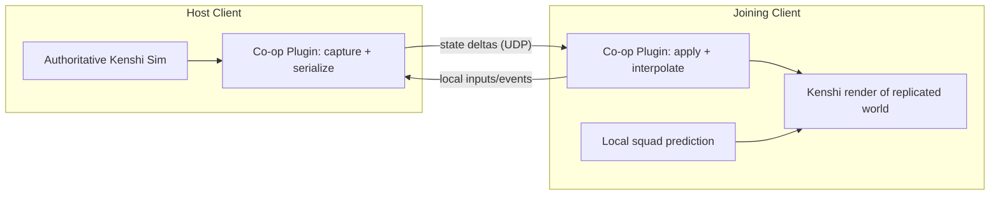

# Kenshi Co-op Master Plan

> Status: Charter / vision document. This describes the overall goal and the
> guardrails we commit to. It is intentionally high level and is NOT detailed
> instrumentation or a line-by-line implementation spec.

## Vision

Enable **two clients to share a single Kenshi gamestate**. One client acts as
the authoritative host; the other joins as a thin client that renders
transmitted world state and predicts only its own squad.

The mod is **our own, independently maintainable** RE_Kenshi / KenshiLib plugin.
We borrow networking and replication *ideas* (not necessarily code) from
[`The404Studios/Kenshi-Online`](https://github.com/The404Studios/Kenshi-Online),
but we author and own our implementation.

## Foundation (decided)

- Built as a **RE_Kenshi / KenshiLib plugin** (the same model as the Direct
  Control mod), loaded via the Ogre plugin system by adding a `Plugin=...` entry
  to `Plugins_x64.cfg`.
- Reuse KenshiLib's maintained function-hooking API and reverse-engineered game
  structures rather than rolling our own MinHook / pattern-scanning layer.
- Licensed **GPLv3** (inherited from KenshiLib). This is compatible with reading
  the Kenshi-Online and Direct Control sources for reference, since both are
  also GPLv3.

## Architecture: server-authoritative thin client ("host world")

- One machine runs *the* real Kenshi simulation and is the **single source of
  truth**.
- The joining client **suppresses its local simulation for replicated entities**
  and renders host-transmitted transforms / state via interpolation.
- **Client-side prediction is applied only to the local player's own squad** to
  hide input latency.
- We deliberately do **NOT** attempt two-independent-simulations-in-sync. Kenshi
  has no determinism, so peer/lockstep simulation would desync irrecoverably.

## Scope

In scope for the long-term goal:

- Two-client shared world, host-authoritative.
- Replication of player squads, nearby NPCs, combat state, and basic world
  objects within the active zone.
- Pure transmit first; client-side prediction limited to the local player's own
  units.

Explicitly deferred / out of scope for v1:

- 16-player scale, master server / server browser.
- Independent player roaming across distant regions (would require client-local
  ambient simulation plus zone handoff/reconciliation).
- Full autonomous world-state sync (faction wars, economy) beyond the active
  zone.

## What we borrow from Kenshi-Online (concepts)

- Ogre plugin injection as the load mechanism (here routed through RE_Kenshi).
- ENet / UDP transport with reliable + unreliable channels, ~20 Hz tick.
- Server-authoritative combat and world state; an entity-ownership model.
- Zone-based interest management; an interpolation buffer (~100 ms) plus delta
  compression.

## Key constraints and risks

- **Engine is single-threaded and NOT thread-safe** (ancient OGRE 2.0
  "Tindalos"). All cross-thread state changes must flow through a deferred
  command queue applied at a safe point in the main tick. This is the **#1
  stability risk**.
- **No determinism** -> mandates server authority; no lockstep.
- **World scale (~870 km^2)** -> never stream the whole world; interest-manage
  the active zone.
- **Save divergence / leftover artifacts** -> recommend fresh saves; maintain a
  single canonical world.

## Phased roadmap (high level, milestone-oriented)

> Re-evaluated after Phases 1 and 2. See `POSTMORTEM.md` for the evidence behind
> the status annotations and the design lessons below. Status tags reflect what
> is actually in the code, which is narrower than the original charter wording.

- **Phase 0 - Foundation: DONE.** Plugin loads under RE_Kenshi; deferred
  main-thread command queue (`MainThreadQueue`); ENet host/join handshake with a
  protocol-version check.
- **Phase 1 - Presence: PARTIAL (MVP).** Two players walk around together without
  crashing via spawned ghost characters and 20 Hz unreliable `PKT_PLAYER_STATE`.
  Delivered transform replication for a single character per player. NOT
  delivered: full squad (only `playerCharacters[0]`), interpolation buffer (we
  ease/extrapolate the latest packet), own-squad client-side prediction, and
  player pose/animation on the wire.
- **Phase 2 - NPCs & Combat: NPC PRESENCE DONE; COMBAT NOT STARTED.**
  - NPC presence: interest-managed (~200u, up to 128 NPCs), transform + task/pose
    streamed at 20 Hz; the client drives NPCs kinematically when moving and
    reproduces the host's task (sit/operate at the same fixture) at rest, with an
    adaptive drift guard. ~7/9 NPCs land at 0.0-0.2m with correct poses.
  - Combat: server-authoritative combat resolution and hit/KO/death replication
    is not yet started.
- **Phase 2.5 - Unify player + NPC replication: WORKING on the shared-save inhabit
  path.** Each player's *full* squad streams through the proven NPC pipeline
  (identity by `hand`, transform-when-moving, task-when-resting); the spawn-ghost
  path for remote players is retired. Authority is an ownership partition: each
  player owns a disjoint, hand-ranked subset of the *shared* squad, streams its
  own, and drives the peer's. Validated on the `sync` save (no frozen leaders,
  NPCs at `gap 0-1 m`). Distinct saves are unsupported (break resolve-by-`hand`).
  Detailed design + resolved questions below; see `POSTMORTEM.md` addendum.
- **Phase 3.5 - Bidirectional per-tab ownership: DONE (keystone co-op milestone).**
  The ownership partition is now **bidirectional and partitioned by squad tab**:
  each player owns the squad members in a disjoint set of *Kenshi squad tabs*
  (a tab = a `Platoon` = the member's `hand` CONTAINER), streams its own tab(s),
  and drives the peer's. `publishOwned` + `applyTargets` run on BOTH clients;
  only `enforceHostAuthority` (world-NPC suppression) stays join-only. A
  drive-exclusion guard prevents a side from ever driving/suppressing its own
  owned hands. Selected by `KENSHICOOP_OWN_SQUAD` (tab ranks; host=`{0}`,
  join=`{1}` default). Validated automatically (`coop_presence` bidirectional
  cross-check at 0 ms + WAN sim) AND by manual control on the `squad1` save (host
  drives tab-0's 2 units, join drives tab-1's 1 unit, both mirror cleanly, neither
  can hijack the peer's tab). This is the "true co-op" presence model: two
  independent players, each authoritative over their own squad tab. See
  `POSTMORTEM.md` addendum "Bidirectional per-tab ownership".
- **Phase 3 - Intent-replication framework (reframed from "NPC fidelity").** The
  sit/stand task-pose win generalizes into a reusable framework: replicate the
  *causes* of an animation (identity + transform + locomotion + AI intent + body
  state) and let the join's engine produce it, with a class-specific quieting lever
  and an authority guard. Each new behavior is a new `(class -> lever-set)` entry
  validated by its own conformance oracle, ordered by ascending risk. See
  `INTENT_REPLICATION.md` for the full design. Sub-phases:
  - **3a Crafting/gathering: DONE.** Reuses the fixture-task lever
    (`detachFromTownAI` + `applyTaskOrder` at the work-station subject); lowest
    risk; proved framework reuse. Validated via `craft_order` (live idle->operating
    order reflected on the join).
  - **3b Body-state layer (L4): DONE.** Laying / unconscious / KO / death / ragdoll.
    Added a compact `bodyState` field to `EntityState` (bumped `PROTOCOL_VERSION`)
    AND the reliable `PKT_EVENT` channel for KO/death/revive transitions. Validated
    via `down_order` (live upright->down) and `death_order` (reliable `EVT_DEATH`
    survives 30% packet loss + latency). `holdDown` refreshes the KO timer so the
    local AI cannot stand a downed body back up. No pathing for a downed body.
  - **3c Combat (L5): DONE.** Target hand + combat intent + reliable hit/KO/death
    events + host-authoritative outcome & attribution. Validated via `combat_probe`
    (host-side combat-state read), `combat_order` (live melee intent replicated so
    a fight that *starts after* the join loads renders correctly), and
    `combat_kill` (deterministic KO with sticky time-windowed attacker
    attribution). Reuses `PKT_EVENT` for transitions; intent rides `TASK_COMBAT_MELEE`.
- **Phase 4 - World objects:** inventory, buildings, and items within the active
  zone (including the production *results* of crafting from 3a).
- **Phase 5 - Hardening:** interpolation buffer for real latency/jitter,
  packet-loss resilience, event ack/resend, rate limiting, reconnect, and
  anti-crash guards.

## Lessons that changed the design

These come out of the Phase 1/2 post-mortem and directly reshape the roadmap:

- **Identity via `hand` is the foundation.** A save-stable `hand` resolves to the
  same logical entity on both machines, which is what makes "drive the real local
  object" possible. Reuse it for every replicated entity.
- **Reproduce intent (task), don't puppet transforms, for resting/interacting
  entities.** Streaming a transform gives the wrong pose; streaming the AI task +
  its subject object (and calling `setCurrentAction`) gives the right pose *and*
  position. Drive transforms only for entities in motion.
- **No determinism means we always need an authority drift-guard / snap.** Local
  AI re-plans and diverges; detect drift and correct or abandon the reproduced
  intent.
- **The other player's squad is "remote NPC-like" state.** Because both clients
  load the same save, squad members are real characters with stable `hand`s on
  the peer - so player presence should ride the NPC pipeline rather than a
  separate spawn-ghost mechanism. This is what Phase 2.5 acts on.
- **Replicate causes, not effects (the spine of Phase 3+).** Confirmed twice now
  (the v4 locomotion mirror and the sit/stand task-pose sync): stream identity +
  transform + locomotion + AI intent + body state, and let the join's engine
  produce the animation - never stream clips/phases (idle/sit/stand are not slave
  animations and `AnimationClass` is opaque). This keeps the per-entity wire cost
  roughly constant as animation variety grows and makes state idempotent
  (loss-tolerant). Two wire implications follow: a new body-state field for
  no-subject poses (laying/KO/death) bumps `PROTOCOL_VERSION`, and one-shot
  transitions (death, KO, hit reactions) need a reliable `PKT_EVENT` sub-channel
  alongside the 20 Hz unreliable state batch (continuous state self-heals; a lost
  death event does not). See `INTENT_REPLICATION.md`.
- **A new behavior is a new `(class -> lever-set)` entry, not new netcode - and the
  same lever applied to the wrong class backfires.** Sitters need detach + a
  location-bound order; standers must NOT be detached (it changes the body's
  container and thus its cross-client `hand`, so the host stops matching it and it
  goes absent). Pick each class's apply lever, quieting lever, and guard
  deliberately.

## Phase 2.5 design: unify remote-player squads onto the NPC pipeline

Rationale: both clients load the SAME save, so each player's squad members are
real characters with stable `hand`s resolvable on the peer - exactly like NPCs.
Remote squads can therefore reuse the Phase 2 machinery instead of spawned
ghosts, which also ports the rest-pose fix to players for free.

Design outline:

- **Wire:** stream owned squad members as `hand + transform + task + subject`
  (reuse the `NpcStateEntry` shape) in a player-owned batch. This is
  **bidirectional** - each peer streams its own squad - unlike the host-only NPC
  stream. It replaces the single-character `PlayerStatePacket` for squad
  replication.
- **Capture (each peer):** enumerate the *whole* `playerCharacters` lektor (not
  just `[0]`) and fill entries via the existing `guardedReadNpc`.
- **Apply (each peer):** resolve each incoming `hand` to the local `Character` and
  drive it with the existing `updateNpcs` regimes (kinematic when moving, task
  reproduction at rest with the drift guard).
- **Authority de-confliction:** maintain a set of remote-owned squad hands and
  exclude them from the host's NPC sphere pick, so a remote player's squad is not
  also streamed back as an NPC. Each peer never drives its own squad.
- **Retire:** the remote-player spawn path (`guardedSpawn` / `guardedQuiet` /
  `createRandomCharacter`) for players.

Open questions to resolve at implementation time:

- Exact authority model for bidirectional squad streaming.
- How to register/identify remote-owned hands (so they are excluded from NPC
  pick and never self-driven).
- Whether to keep a lightweight `PlayerStatePacket` self-heartbeat (presence,
  join/leave) alongside the squad batch.
- Interpolation needs once tested over real latency rather than localhost.

Resolved during the Co-op Drive Refoundation (see `POSTMORTEM.md` addendum):

- **Shared save is mandatory.** Resolve-by-`hand` only works when both clients
  load the identical save; distinct saves are a dead-end (flagged unsupported in
  `manual_session.ps1`).
- **Authority model = ownership partition (the "inhabit" model).** Both clients
  load the same save, but each player OWNS a disjoint subset of the shared squad:
  it locally controls + streams its owned members and DRIVES the peer's owned
  members from their stream. This fixed the "frozen leader" gap (previously each
  client claimed the whole squad and the own-guard skipped the peer's members).
- **Ownership identity = stable hand-derived rank**, NOT `Character::squadMemberID`
  (the engine reports `0` for every player-squad member, so it can't disambiguate).
  Members are sorted by save-stable `hand`; the ordinal (0 = leader) is identical
  cross-client and survives list reordering. `KENSHICOOP_OWN_INDICES` selects on
  this rank as a test override; production ownership should derive from a stable
  identity assigned at join.
- **Suppress AI in-place, do NOT remove from the update list.** `removeFromUpdateListMain`
  freezes the movement controller (the body renders but stops moving). Driven
  bodies must stay on the update list so the controller flushes our teleport;
  quiet the AI via `clearGoals`/`neutralize` + the v4 locomotion mirror instead.

## Testing strategy & validation stages

Validation is the project's backbone: every behavior class is proven by a
repeatable RED/GREEN check, not by eyeballing one screenshot. The strategy has
four layers, applied in order, and a behavior is only "done" when it clears all
four for its class.

### The conformance triplet (per behavior class)

Each new class (pose, body-state, combat, presence) ships three things (detailed
in `INTENT_REPLICATION.md`):

1. **Host ground-truth read** - the authoritative engine state on the host (task +
   subject for poses; `isDown`/health for L4; a combat-state read for L5; member
   `hand` + transform for presence).
2. **Join rendered-body read** - read the *result on the animated body* (e.g. the
   `Bip01 Pelvis` world height via `engine::readPoseState`), NOT the field we wrote,
   so a written flag cannot fake a PASS.
3. **Tolerance comparator + deterministic scenario** - a compiled `Scenario`
   (`src/plugin/test/Scenario.cpp`, driven via `ScenarioApi.h`) sets up the state
   on both clients; a comparator in `scripts/run_test.ps1` time-aligns the host and
   join reads and emits a verdict.

### The harness layers

1. **Compiled scenario harness.** Deterministic, time-gated state machines that run
   in the main loop on both clients, selected by `KENSHICOOP_SCENARIO`. They emit
   structured log markers (`SCENARIO MEMBER/RECV/...`) the runner anchors on. All
   game mutation goes through the SEH-guarded `ScenarioApi`.
2. **Bake scenes.** Host-only one-shot world setup (`setupCraftScene`,
   `setupDownScene`, `setupDuelScene`, `setupSquadScene`) that the user SAVEs to a
   canonical save (`craft1`, `down1`, `duel1`, `squad1`); both clients then load
   the identical save (shared-save is mandatory for resolve-by-`hand`). Bakes are
   machine-verifiable from the host log (e.g. the squad bake dumps distinct
   containers = distinct tabs).
3. **Automated host+join runner** (`scripts/run_test.ps1`). Build -> deploy ->
   launch both clients -> screenshot (incl. burst frames for animation) -> parse
   logs -> per-class oracle -> RED/GREEN verdict. Per-scenario oracles:
   `Compare-NpcSync`/`CROSSCHECK`, `Test-DownOrder`, `Test-CombatProbe`,
   `Test-CoopPresence` (bidirectional). Locomotion-quality metrics (`smoothness`,
   `anim-truth`) gate locomotion scenarios but are **advisory** for placement/state
   scenarios (e.g. `coop_presence`), where latency micro-slide on a mostly-static
   body is a known cosmetic seam, not a presence failure.
4. **Manual visual gate.** After the automated oracle is green, a manual co-op
   session (`scripts/manual_session.ps1` + side-by-side window arrange via
   `scripts/arrange_windows.ps1`) confirms the result with a human in the loop
   (e.g. driving each squad tab on its owning client).

### Conditions we validate under

- **0 ms (localhost)** for correctness, then a **WAN simulator** (`netSimDelayMs` /
  `netSimJitterMs` / `netSimLossPct`) for latency/jitter/loss realism - a per-frame
  correction that looks perfect on localhost must survive real RTT.
- **Live transitions, not just loaded state.** A class is validated by making the
  transition happen *after* the join has loaded (spawn-then-order, upright->down,
  fight-starts-after-join), not only by loading a save already in the end state.
- **Regression sweep.** After any partition/authority change, re-run prior green
  scenarios (`npc_sync`, `combat_kill`, the bar multi-NPC scene) to confirm no
  regression.

## Success criteria

- **v1:** two players co-located in one shared, host-authoritative world; smooth
  movement, working combat, and stability across a typical play session.
- The mod is **independently buildable and maintainable** by us as a
  RE_Kenshi / KenshiLib plugin.
